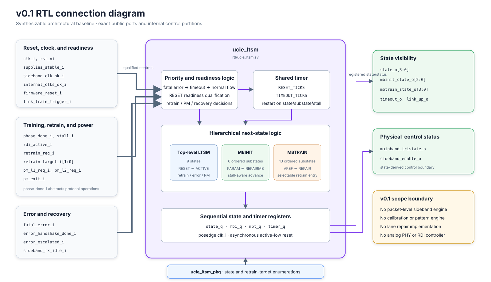
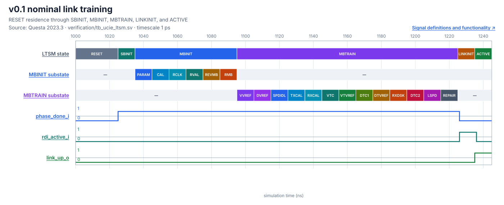

# UCIe 2.0 Link Training State Machine

A synthesizable SystemVerilog model of the UCIe 2.0 Link Training State Machine (LTSM), developed as a progressive design-and-verification project.

> **Current stable milestone:** `v0.1-basic-ltssm`
>
> **Reference:** UCIe Specification Revision 2.0, Version 1.0 (August 6, 2024)
>
> **Scope:** LTSM control flow with abstract completion/error handshakes - not a complete UCIe PHY and not a claim of UCIe compliance.

## What is implemented

- Nine top-level LTSM states: `RESET`, `SBINIT`, `MBINIT`, `MBTRAIN`, `LINKINIT`, `ACTIVE`, `PHYRETRAIN`, `TRAINERROR`, and `L1L2`.
- Six ordered `MBINIT` substates and thirteen ordered `MBTRAIN` substates.
- Parameterized RESET residence and state/substate timeout counters.
- Stall-driven timeout restart, ACTIVE retraining, power-management exit paths, and error recovery.
- A self-checking directed testbench and five SystemVerilog properties/coverage properties.
- A reusable UVM agent, monitor, scoreboard, four scenario tests, and fresh passing regression logs.
- A Quartus project for Cyclone 10 LP with successful fitting and timing analysis.
- A versioned v0.1 evidence pack with Questa-derived waveform SVGs, RTL/UVM connection diagrams, and a Quartus functional Verilog netlist.

The model uses `phase_done_i` to represent the completion of work that a complete design would perform using sideband messages, calibration logic, repair algorithms, training-pattern engines, and analog PHY controls. Those components are not yet implemented.

## Start here


| Topic | Documentation |
|---|---|
| First-time overview | [Getting started](docs/00_getting_started/README.md) |
| Project boundary and interfaces | [Architecture](docs/01_ucie_architecture/README.md) |
| States, transitions, signals, and timing | [LTSM](docs/02_ltssm/README.md) |
| Behavior before RTL syntax | [Algorithm and pseudocode](docs/03_algorithm/README.md) |
| Source hierarchy and implementation | [RTL guide](docs/04_rtl/README.md) |
| Directed tests, UVM, assertions, and coverage | [Verification guide](docs/05_verification/README.md) |
| Questa and Quartus evidence | [Results](docs/06_results/README.md) |
| Requirement-to-code traceability | [Traceability matrix](docs/requirements_traceability.md) |
| Version history | [Version documentation](docs/versions/README.md) |

## Architecture at this milestone



The diagram shows only implemented ports and control partitions. The v0.1 scope box explicitly identifies planned blocks that do not yet exist.

## v0.1 evidence pack

| Artifact | Published file | Provenance |
|---|---|---|
| Nominal waveform | [SVG](assets/waveforms/v0.1-basic-ltssm/nominal-training.svg) | Questa VCD from the directed self-checking test |
| Retrain/error waveform | [SVG](assets/waveforms/v0.1-basic-ltssm/retrain-error-recovery.svg) | Same directed Questa run |
| RTL connections | [SVG](assets/diagrams/v0.1-basic-ltssm/rtl-connections.svg) | `ucie_ltsm.sv` ports and internal partitions |
| Verification connections | [SVG](assets/diagrams/v0.1-basic-ltssm/verification-connections.svg) | Actual UVM package/top and SVA connections |
| Quartus netlist | [Verilog](synthesis/quartus/netlists/v0.1-basic-ltssm/ucie_ltsm.vo) | Quartus 23.1 functional EDA netlist for the checked Cyclone 10 LP target |



The [v0.1 milestone page](docs/versions/v0.1_basic_ltssm.md) presents both waveforms and both connection diagrams with interpretation and limitations.

## Versions

| Version | Base | New addition | Verification | Status |
|---|---|---|---|---|
| v0.1 | Initial | Basic hierarchical LTSM controller | Directed + four UVM tests + SVA | Stable within stated scope |
| v0.2 | v0.1 | Sideband message sequencing | To be defined with implementation | Planned |
| v0.3 | v0.2 | Concrete training-operation engines | To be defined with implementation | Planned |
| v0.4 | v0.3 | Expanded recovery and error reporting | To be defined with implementation | Planned |
| v1.0 | Later milestones | Integrated verified controller | Evidence not yet available | Future |

See the [roadmap](ROADMAP.md), [changelog](CHANGELOG.md), and [v0.1 milestone page](docs/versions/v0.1_basic_ltssm.md).

## Repository structure

```text
rtl/                 Synthesizable package and LTSM controller
verification/        Directed testbench, SVA, and UVM environment
scripts/             Questa directed and UVM run scripts
quartus/             Reproducible Quartus project and selected summaries
synthesis/           Reviewed generated netlists organized by release
assets/              Versioned diagrams and rendered waveform figures
docs/                Learning path, design, verification, and results
references_private/  Local specification material; ignored by Git
```

Generated simulator libraries, raw logs, Quartus databases, programming files, and private specification extracts are excluded through [`.gitignore`](.gitignore).

## Reproduce the results

### Directed Questa test

From the repository root:

```powershell
& 'C:\intelFPGA_lite\questa_fse\win64\vsim.exe' -c -do scripts/run_questa.do
```

Expected evidence: `PASS: nominal training, retrain, and error recovery`, followed by zero simulator errors.

To regenerate the release waveform figures:

```powershell
& 'C:\intelFPGA_lite\questa_fse\win64\vsim.exe' -c -do scripts/capture_directed_waveform.do
python scripts/render_waveforms.py
```

The intermediate VCD is ignored; the two reviewed SVG figures are versioned.

### UVM regression

```powershell
.\scripts\run_uvm_regression.ps1
```

The script runs `nominal_test`, `timeout_test`, `recovery_test`, and `pm_test`, and rejects a log that does not report zero UVM errors and fatals.

### Quartus

```powershell
Push-Location quartus
& 'C:\intelFPGA_lite\23.1std\quartus\bin64\quartus_sh.exe' --flow compile ucie_ltsm
Pop-Location
```

The checked project targets `10CL025YU256C8G` and constrains `clk_i` to 12.5 ns (80 MHz). See the [Quartus results page](docs/06_results/quartus.md) for measured resource and timing data.

To rebuild and export the reviewed functional netlist:

```powershell
.\scripts\export_quartus_netlist.ps1
```

## Current limitations

- Sideband packet transport and the SBINIT physical procedure are abstracted.
- Mainband calibration, pattern generation/checking, lane repair/degrade, and analog PHY controls are abstracted.
- RDI, DVSEC/CSR, management transport, detailed error logging, and compliance testing are absent.
- UVM functional covergroups and per-substate coverage closure are absent.
- The UVM suite does not yet test the L2 exit or all three retrain targets.
- No Cadence synthesis, timing, area, or power evidence is present.

## Reference policy

The design was studied against *UCIe Specification Revision 2.0, Version 1.0*, August 6, 2024. Specification PDFs and extracted text stay in `references_private/` and are not published. Public documentation paraphrases the relevant concepts and identifies useful section numbers. The official specification is available from the [UCIe Consortium](https://www.uciexpress.org/specifications).

## Contributing and status

Before changing RTL or verification, read [CONTRIBUTING.md](CONTRIBUTING.md). Known documentation gaps and evidence still requiring review are tracked in [DOCUMENTATION_STATUS.md](DOCUMENTATION_STATUS.md).

The three-task design, verification, and GitHub publication sequence is defined in the [incremental development workflow](docs/development_workflow.md).
