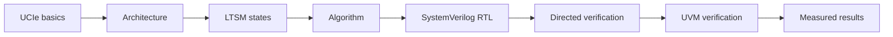

# UCIe 2.0 Link Training State Machine

A synthesizable SystemVerilog model of the UCIe 2.0 Link Training State Machine (LTSM), developed as a progressive design-and-verification project.

> **Current release:** `v0.4-error-recovery`
>
> **Reference:** UCIe Specification Revision 2.0, Version 1.0 (August 6, 2024)
>
> **Scope:** LTSM control flow, one bounded SBINIT sideband transaction, one digital DATATRAINCENTER1 LFSR operation, retained/classified digital TRAINERROR events, and a compact FPGA CSR wrapper - not a complete UCIe PHY and not a claim of UCIe compliance.

## What is implemented

- Nine top-level LTSM states: `RESET`, `SBINIT`, `MBINIT`, `MBTRAIN`, `LINKINIT`, `ACTIVE`, `PHYRETRAIN`, `TRAINERROR`, and `L1L2`.
- Six ordered `MBINIT` substates and thirteen ordered `MBTRAIN` substates.
- Parameterized RESET residence and state/substate timeout counters.
- Stall-driven timeout restart, ACTIVE retraining, power-management exit paths, and error recovery.
- A synthesizable ready/valid sequencer for `SBINIT_DONE_REQ`/`SBINIT_DONE_RESP`, with backpressure, response matching, bounded retry, timeout, abort, and protocol-error reporting.
- A synthesizable 16-lane, 23-bit LFSR training engine in `MBT_DATATRAINCENTER1`, with accepted-sample progression, a saturating error count, strict threshold result, and automatic successful advance.
- A synthesizable error manager with one-event retention, bounded handshake, fixed timeout/sideband/local-fatal priority, controlled log clearing, and a saturating 16-bit event counter.
- A separate synthesizable FPGA wrapper that keeps the reusable core unchanged, internalizes wide diagnostics, and exposes state/status/counters through a byte CSR at `0x00`-`0x10`.
- Self-checking controller, sideband, LFSR, and error-manager directed testbenches plus feature-specific SystemVerilog assertions/coverage properties.
- A standalone sideband directed test with three protocol assertions.
- A reusable UVM agent, reset-aware driver, passive monitor, scoreboard, nine deterministic tests, and five-seed sideband, DATATRAINCENTER1, and recovery campaigns with independent prediction and explicit sampled coverage.
- A separate wrapper Quartus project for Cyclone 10 LP with a successful 119-pin fit, zero virtual pins, and positive internal setup/hold timing at 80 MHz; board pin locations and external I/O timing remain incomplete.
- Versioned v0.1 through v0.4 evidence packs with Questa-derived waveform SVGs, RTL/UVM connection diagrams, and Quartus functional Verilog netlists.

Version 0.2 replaces the normal SBINIT completion abstraction with a transaction-level request/response path. Version 0.3 replaces one MBTRAIN abstraction with a concrete digital LFSR operation. Version 0.4 retains and classifies accepted TRAINERROR events across short pulses, delayed/missing acknowledgment, residency, and controlled clearing, then provides a fitted compact FPGA/CSR boundary. `phase_done_i` remains a compatibility bypass for operations that are not implemented.

## Start here



| Topic | Documentation |
|---|---|
| First-time overview | [Getting started](docs/00_getting_started/README.md) |
| Definitions and abbreviation long forms | [Project glossary](docs/glossary.md) |
| Project boundary and interfaces | [Architecture](docs/01_ucie_architecture/README.md) |
| States, transitions, signals, and timing | [LTSM](docs/02_ltssm/README.md) |
| Behavior before RTL syntax | [Algorithm and pseudocode](docs/03_algorithm/README.md) |
| Source hierarchy and implementation | [RTL guide](docs/04_rtl/README.md) |
| Directed tests, UVM, assertions, and coverage | [Verification guide](docs/05_verification/README.md) |
| Questa and Quartus evidence | [Results](docs/06_results/README.md) |
| Requirement-to-code traceability | [Traceability matrix](docs/requirements_traceability.md) |
| Version history | [Version documentation](docs/versions/README.md) |

## Architecture at this milestone


The diagram shows the unchanged verified core inside the compact FPGA boundary, the internalized state/training/error diagnostics, the CSR decoder, the 119-pin implementation result, and the remaining digital-only scope boundary.

## v0.4 evidence pack

| Artifact | Published file | Provenance |
|---|---|---|
| Retained handshake waveform | [SVG](assets/waveforms/v0.4-error-recovery/retained-handshake.svg) | Questa VCD from the self-checking error-manager test |
| Timeout/priority waveform | [SVG](assets/waveforms/v0.4-error-recovery/timeout-and-priority.svg) | Same directed run: de-duplication, manager timeout, immediate entry, cause priority |
| FPGA CSR waveform | [SVG](assets/waveforms/v0.4-error-recovery/fpga-csr-read-clear.svg) | Wrapper test: state/status/cause/count reads, ignored TRAINERROR clear, allowed RESET clear, invalid read |
| RTL connections | [SVG](assets/diagrams/v0.4-error-recovery/rtl-connections.svg) | `ucie_ltsm` and `ucie_error_manager` integration |
| Verification connections | [SVG](assets/diagrams/v0.4-error-recovery/verification-connections.svg) | Five-seed UVM, predictor, SVA, explicit coverage, and preserved regressions |
| FPGA wrapper connections | [SVG](assets/diagrams/v0.4-error-recovery/fpga-csr-wrapper.svg) | Core/wrapper/CSR boundary and qualified implementation result |
| Fitted wrapper netlist | [Verilog](synthesis/quartus/netlists/v0.4-error-recovery/ucie_ltsm_fpga_wrapper.vo) | Quartus 23.1 functional netlist for the fitted 119-pin wrapper |
| Core-only netlist | [Verilog](synthesis/quartus/netlists/v0.4-error-recovery/ucie_ltsm.vo) | Synthesis/functional-simulation view; no core-top fit claim |
| Netlist provenance | [Manifest](synthesis/quartus/netlists/v0.4-error-recovery/README.md) | SHA-256 identities, generation boundary, and limitations |
| Signal/function guide | [Documentation](docs/02_ltssm/signals.md#v04-error-recovery-signal-guide) | Functional interpretation for every plotted v0.4 signal |
| Definitions and long forms | [Glossary](docs/glossary.md#v04-error-recovery-and-fpga-wrapper-terms) | Canonical recovery, CSR, and FPGA terminology |


The [v0.4 milestone page](docs/versions/v0.4_error_recovery.md) records the 180 randomized recovery trials, full preserved regression, reviewed visuals, qualified Quartus results, versioned netlist, and remaining limitations.

## v0.3 evidence pack

| Artifact | Published file | Provenance |
|---|---|---|
| Pattern progression waveform | [SVG](assets/waveforms/v0.3-advanced-training/pattern-progression.svg) | Questa VCD from the self-checking LFSR engine test |
| Threshold/abort waveform | [SVG](assets/waveforms/v0.3-advanced-training/threshold-and-abort.svg) | Same directed run: pass, equality fail, pass, abort |
| RTL connections | [SVG](assets/diagrams/v0.3-advanced-training/rtl-connections.svg) | `ucie_ltsm` and `ucie_lfsr_training_engine` integration |
| Verification connections | [SVG](assets/diagrams/v0.3-advanced-training/verification-connections.svg) | Seeded UVM, independent model, scoreboard, SVA, explicit coverage, and directed proof |
| Quartus netlist | [Verilog](synthesis/quartus/netlists/v0.3-advanced-training/ucie_ltsm.vo) | Quartus 23.1 functional netlist for the checked Cyclone 10 LP target |
| Signal/function guide | [Documentation](docs/02_ltssm/signals.md#v03-training-signal-guide) | Functional interpretation for every plotted v0.3 signal |
| Definitions and long forms | [Glossary](docs/glossary.md) | Canonical project terminology and abbreviation expansions |


The [v0.3 milestone page](docs/versions/v0.3_advanced_training.md) presents both waveforms and both diagrams with the five-seed results, Quartus evidence, netlist identity, reproduction commands, and explicit limitations.

## v0.2 evidence pack

| Artifact | Published file | Provenance |
|---|---|---|
| Success/retry waveform | [SVG](assets/waveforms/v0.2-sideband/success-bounded-retry.svg) | Questa VCD from the standalone sequencer test |
| Error/abort waveform | [SVG](assets/waveforms/v0.2-sideband/exhaustion-mismatch-abort.svg) | Same sideband-directed Questa run |
| RTL connections | [SVG](assets/diagrams/v0.2-sideband/rtl-connections.svg) | `ucie_ltsm` and `ucie_sb_sequencer` integration |
| Verification connections | [SVG](assets/diagrams/v0.2-sideband/verification-connections.svg) | Eight UVM tests, event monitor/scoreboard, SVA, and standalone directed test |
| Quartus netlist | [Verilog](synthesis/quartus/netlists/v0.2-sideband/ucie_ltsm.vo) | Quartus 23.1 functional EDA netlist for the checked Cyclone 10 LP target |
| Signal/function guide | [Documentation](docs/02_ltssm/signals.md#waveform-signal-guide) | Definitions and functional interpretation for every plotted signal |


The [v0.2 milestone page](docs/versions/v0.2_sideband.md) presents both waveforms and both connection diagrams with interpretation and limitations. The [randomized verification update](docs/versions/v0.2_random_uvm.md) records the later verification-only tag; the [v0.1 page](docs/versions/v0.1_basic_ltssm.md) and tag preserve the earlier baseline.

## v0.2 randomized verification evidence


| Artifact | Published file | What it shows |
|---|---|---|
| Seed/outcome summary | [SVG](assets/diagrams/v0.2-random-uvm/random-regression-summary.svg) | Five seeds, 200 trials, scenario distribution, aggregate event totals, and pass verdicts |
| Random UVM connections | [SVG](assets/diagrams/v0.2-random-uvm/random-verification-flow.svg) | Seed control, legal domains, driver/DUT/monitor path, predictor, assertions, and comparator |
| Detailed results | [Questa page](docs/06_results/questa.md#seeded-randomized-regression) | Per-outcome counts, commands, tool boundary, and limitations |
| Existing v0.2 implementation evidence | [v0.2 page](docs/versions/v0.2_sideband.md) | Unchanged RTL waveforms, connection diagrams, Quartus results, and functional netlist |
| Netlist identity | [Manifest](synthesis/quartus/netlists/v0.2-random-uvm/README.md) | Confirms the new tag reuses the byte-identical v0.2 functional netlist and SHA-256 |

## Versions

| Version | Base | New addition | Verification | Status |
|---|---|---|---|---|
| v0.1 | Initial | Basic hierarchical LTSM controller | Directed + four UVM tests + SVA | Stable within stated scope |
| v0.2 | v0.1 | Bounded SBINIT sideband sequencing | Directed + eight UVM tests + SVA | Stable within stated scope |
| v0.2-random | v0.2 | Verification-only seeded random campaign | Five seeds / 200 trials + preserved regression | Stable verification update |
| v0.3 | v0.2-random | DATATRAINCENTER1 digital LFSR training | Five seeds / 160 trials + independent model + SVA + directed 4096 proof | Stable within stated scope |
| v0.4 | v0.3 | Retained/classified TRAINERROR events + compact FPGA CSR wrapper | Five recovery seeds / 180 trials + predictor/SVA + directed recovery/CSR proof + qualified Quartus fit | Stable within stated scope |
| v1.0 | Later milestones | Integrated verified controller | Evidence not yet available | Future |

See the [roadmap](ROADMAP.md), [changelog](CHANGELOG.md), and [v0.4 milestone page](docs/versions/v0.4_error_recovery.md).

## Repository structure

```text
rtl/                 Synthesizable package, LTSM, engines, error manager, and FPGA CSR wrapper
verification/        Directed testbench, SVA, and UVM environment
scripts/             Questa directed and UVM run scripts
quartus/             Reproducible Quartus project and selected summaries
synthesis/           Reviewed generated netlists organized by release
assets/              Versioned diagrams and rendered waveform figures
docs/                Learning path, design, verification, and results
references_private/  Local specification material; ignored by Git
```

Generated simulator libraries, raw logs, Quartus databases, programming files, and private specification extracts are excluded through [`.gitignore`](.gitignore).

## Reproduce the results

### Directed Questa test

From the repository root:

```powershell
& 'C:\intelFPGA_lite\questa_fse\win64\vsim.exe' -c -do scripts/run_questa.do
```

Expected evidence: `PASS: nominal training, retrain, and error recovery`, followed by zero simulator errors.

Run the standalone sideband protocol test:

```powershell
& 'C:\intelFPGA_lite\questa_fse\win64\vsim.exe' -c -do scripts/run_sb_directed.do
```

Expected evidence: `PASS: sideband backpressure, success, retry, exhaustion, mismatch, and abort`.

Run the focused v0.4 error-manager proof:

```powershell
& 'C:\intelFPGA_lite\questa_fse\win64\vsim.exe' -c -do scripts/run_error_directed.do
```

Expected evidence: `PASS: error retention, priority, handshake bound, clear rules, and saturation`.

Run the compact FPGA/CSR wrapper proof:

```powershell
& 'C:\intelFPGA_lite\questa_fse\win64\vsim.exe' -c -do scripts/run_fpga_wrapper_directed.do
```

Expected evidence: `PASS: FPGA wrapper CSR state, status, retained error, protected clear, and release`.

To regenerate the release waveform figures:

```powershell
& 'C:\intelFPGA_lite\questa_fse\win64\vsim.exe' -c -do scripts/capture_directed_waveform.do
python scripts/render_waveforms.py
```

The intermediate VCD is ignored; the two reviewed SVG figures are versioned.

Regenerate the v0.2 sideband waveform figures:

```powershell
& 'C:\intelFPGA_lite\questa_fse\win64\vsim.exe' -c -do scripts/capture_sideband_waveform.do
python scripts/render_sideband_waveforms.py
```

Regenerate the v0.3 DATATRAINCENTER1 waveform figures:

```powershell
& 'C:\intelFPGA_lite\questa_fse\win64\vsim.exe' -c -do scripts/capture_datatrain_waveform.do
python scripts/render_datatrain_waveforms.py
```

Regenerate the v0.4 recovery waveform figures:

```powershell
& 'C:\intelFPGA_lite\questa_fse\win64\vsim.exe' -c -do scripts/capture_error_waveform.do
& 'C:\intelFPGA_lite\questa_fse\win64\vsim.exe' -c -do scripts/capture_fpga_wrapper_waveform.do
python scripts/render_error_waveforms.py
```

### UVM regression

```powershell
.\scripts\run_uvm_regression.ps1
```

The script runs the preserved controller/sideband tests plus `recovery_closure_test`, for nine deterministic UVM tests total. It rejects any log that does not report zero UVM errors and fatals.

Run the repeatable constrained-domain randomized campaign:

```powershell
.\scripts\run_random_regression.ps1
```

This runs `sb_random_test` with seeds `101`, `202`, `303`, `404`, and `505`; each seed executes 40 reset-isolated transactions with independently selected 1–3 cycle transmit backpressure and response delay. Questa Starter does not license class `randomize()`, so the explicit domains use seeded `$urandom_range` and an end-of-test predictor/monitor comparison.

Run the v0.3 DATATRAINCENTER1 campaign:

```powershell
.\scripts\run_datatrain_random_regression.ps1
```

This runs seeds `701`, `802`, `903`, `1004`, and `1105`, each with 32 reset-isolated trials. The independent model checks lane seeds, every 23-bit polynomial step, generated/received patterns, corruption masks, saturated counts, and strict results. Explicit sampled bins/crosses replace native covergroups under the Starter license.

Run the v0.4 retained/classified recovery campaign:

```powershell
.\scripts\run_recovery_random_regression.ps1
```

This runs seeds `1201`, `1302`, `1403`, `1504`, and `1605`, each with 36 trials across seven eligible origins and six recovery scenarios. The predictor checks exact cause/count retention, entry timing, residency, and release; explicit sampled scenario/origin/pulse/ack bins and legal crosses replace native covergroups.

### Quartus

```powershell
Push-Location quartus
& 'C:\intelFPGA_lite\23.1std\quartus\bin64\quartus_sh.exe' --flow compile ucie_ltsm_fpga
Pop-Location
```

The checked project targets `10CL025YU256C8G` and constrains `clk_i` to 12.5 ns (80 MHz). See the [Quartus results page](docs/06_results/quartus.md) for measured resource and timing data.

To rebuild and export the reviewed functional netlist:

```powershell
.\scripts\export_quartus_netlist.ps1 -Version v0.4-error-recovery -Project ucie_ltsm_fpga -OutputName ucie_ltsm_fpga_wrapper.vo
```

## Current limitations

- Only the SBINIT-done request/response pair is implemented; physical sideband detection, repair, framing, CRC, credits, and the broader message set are absent.
- `phase_done_i` can still bypass the SBINIT sideband handshake.
- Only one digital DATATRAINCENTER1 pattern/check operation is concrete; analog calibration, physical pattern transport, Vref/phase search, equalization, lane repair/degrade, and analog PHY controls remain abstracted.
- RDI, a standards-defined DVSEC/management transport, firmware interrupts, and compliance testing are absent; the implemented byte CSR is a compact FPGA debug/management boundary only.
- Native UVM covergroups/UCDB percentages and full per-substate coverage closure are absent; v0.4 uses explicit sampled bins/crosses.
- External I/O delays and exact package pin locations remain unspecified. The selected wrapper uses 119 physical pins and zero virtual pins, so its positive slack qualifies internal clock paths rather than board timing.
- No Cadence synthesis, timing, area, or power evidence is present.

## Reference policy

The design was studied against *UCIe Specification Revision 2.0, Version 1.0*, August 6, 2024. Specification PDFs and extracted text stay in `references_private/` and are not published. Public documentation paraphrases the relevant concepts and identifies useful section numbers. The [specification figure and section index](docs/specification_figure_index.md) provides original project diagrams with manual figure, section, table, and page locators. The official specification is available from the [UCIe Consortium](https://www.uciexpress.org/specifications).

## Contributing and status

Before changing RTL or verification, read [CONTRIBUTING.md](CONTRIBUTING.md). Known documentation gaps and evidence still requiring review are tracked in [DOCUMENTATION_STATUS.md](DOCUMENTATION_STATUS.md).

The three-task design, verification, and GitHub publication sequence is defined in the [incremental development workflow](docs/development_workflow.md).
