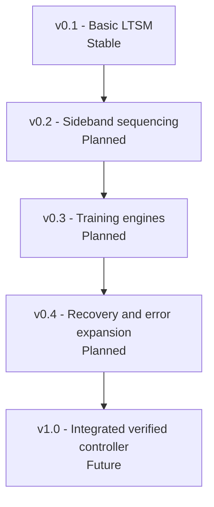

# Project Roadmap

This roadmap separates demonstrated work from intended work. A planned item is not an implementation claim.

## v0.1 - Basic LTSM

Status: **stable within the abstract controller scope**

- Hierarchical top-level, MBINIT, and MBTRAIN state progression.
- Parameterized RESET and timeout timing.
- Retrain, error, and L1/L2 control paths.
- Directed test, SVA, and four UVM scenarios.
- Successful Cyclone 10 LP implementation and constrained timing analysis.

## v0.2 - Sideband sequencing

Status: **planned**

- Replace selected uses of `phase_done_i` with a real, separately verified sideband request/response sequencer.
- Define message interfaces only after the implementation is present.
- Add directed and UVM tests for timeout, retry, malformed response, and partner latency as supported by the implementation.

## v0.3 - Training-operation engines

Status: **planned**

- Integrate concrete mainband training operations, pattern control, and result handshakes.
- Add implementation-specific MBINIT/MBTRAIN checks and coverage.

## v0.4 - Recovery and error expansion

Status: **planned**

- Expand error categorization, reporting, escalation, and recovery tests.
- Close L2 and retrain-target verification gaps that remain after earlier milestones.

## v1.0 - Integrated verified controller

Status: **future**

The acceptance criteria are intentionally not declared complete. They must be defined from the integrated RTL, verification plan, implementation environment, and available evidence at that time.
