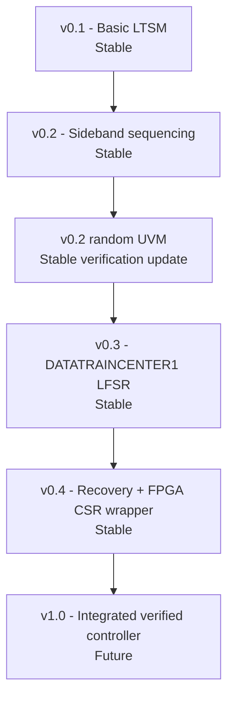

# Project Roadmap

This roadmap separates demonstrated work from intended work. A planned item is not an implementation claim.

## v0.1 - Basic LTSM

Status: **stable within the abstract controller scope**

- Hierarchical top-level, MBINIT, and MBTRAIN state progression.
- Parameterized RESET and timeout timing.
- Retrain, error, and L1/L2 control paths.
- Directed test, SVA, and four UVM scenarios.
- Successful Cyclone 10 LP implementation and constrained timing analysis.

## v0.2 - Sideband sequencing

Status: **stable within the bounded SBINIT transaction scope**

- Integrates a ready/valid `SBINIT_DONE_REQ`/`SBINIT_DONE_RESP` sequencer into SBINIT.
- Holds the outbound request under backpressure and checks the expected response.
- Implements configurable response timeout, one bounded retry by default, retry exhaustion, malformed-response error, and abort.
- Preserves the four v0.1 UVM scenarios and adds four sideband-specific UVM tests plus an isolated directed test.
- Publishes VCD-derived sideband waveforms, updated connection diagrams, fresh Quartus summaries, and a versioned functional netlist.

## v0.2 randomized UVM update

Status: **stable verification-only update**

- Preserves the v0.2 RTL and implementation evidence unchanged.
- Adds a five-seed, 200-transaction constrained-domain campaign for success, retry-success, wrong-response, and retry-exhaustion outcomes.
- Randomizes transmit backpressure and response delay independently over one through three cycles.
- Checks cumulative predicted event totals against a passive monitor and retains the complete deterministic regression gate.
- Publishes reviewed seed/outcome and UVM connection-flow figures with links to detailed results and limitations.

## v0.3 - DATATRAINCENTER1 LFSR training

Status: **stable within the digital training-control scope**

- Integrates sixteen 23-bit LFSRs and a 16-bit training pattern in `DATATRAINCENTER1`.
- Advances only on accepted receive samples, accumulates errors with saturation, and applies a strict threshold.
- Uses a five-seed independent-reference UVM campaign, training SVA, explicit sampled coverage, a focused 4096-sample directed proof, and the preserved v0.2 regressions.
- Publishes reviewed colorful waveforms, RTL/verification connection diagrams, Quartus implementation summaries, and a versioned functional netlist.
- Leaves analog calibration, physical channel behavior, BER qualification, lane repair, and remaining training operations for later milestones.

## v0.4 - Retained recovery and FPGA CSR wrapper

Status: **stable within the stated digital-control/FPGA-wrapper scope**

- Retains one eligible timeout, sideband-protocol, or local-fatal event with fixed cause priority and a saturating event counter.
- Holds a bounded handshake request, preserves the log through TRAINERROR recovery, and protects clearing in pending/TRAINERROR states.
- Adds five recovery seeds / 180 predictor-checked trials, recovery SVA/explicit coverage, directed saturation/boundary proof, and closure of L2/all retrain-target gaps.
- Adds a separate byte-CSR FPGA wrapper that leaves `ucie_ltsm` unchanged, reduces the physical top from 149 to 119 pins, and uses zero virtual pins.
- Publishes reviewed recovery/CSR waveforms, three connection diagrams, qualified Quartus summaries, and two provenance-qualified functional netlists.
- Leaves analog PHY behavior, standards-defined DVSEC/software management, board I/O timing, ASIC PPA, BER, and compliance for later work.

## v1.0 - Integrated verified controller

Status: **future**

The acceptance criteria are intentionally not declared complete. They must be defined from the integrated RTL, verification plan, implementation environment, and available evidence at that time.
