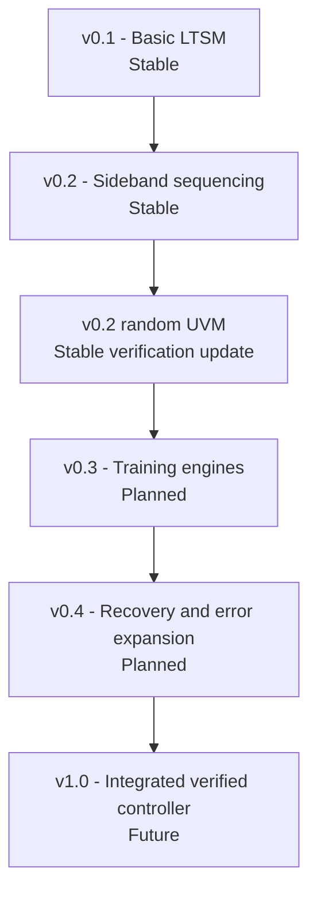

# Project Roadmap

This roadmap separates demonstrated work from intended work. A planned item is not an implementation claim.

## v0.1 - Basic LTSM

Status: **stable within the abstract controller scope**

- Hierarchical top-level, MBINIT, and MBTRAIN state progression.
- Parameterized RESET and timeout timing.
- Retrain, error, and L1/L2 control paths.
- Directed test, SVA, and four UVM scenarios.
- Successful Cyclone 10 LP implementation and constrained timing analysis.

## v0.2 - Sideband sequencing

Status: **stable within the bounded SBINIT transaction scope**

- Integrates a ready/valid `SBINIT_DONE_REQ`/`SBINIT_DONE_RESP` sequencer into SBINIT.
- Holds the outbound request under backpressure and checks the expected response.
- Implements configurable response timeout, one bounded retry by default, retry exhaustion, malformed-response error, and abort.
- Preserves the four v0.1 UVM scenarios and adds four sideband-specific UVM tests plus an isolated directed test.
- Publishes VCD-derived sideband waveforms, updated connection diagrams, fresh Quartus summaries, and a versioned functional netlist.

## v0.2 randomized UVM update

Status: **stable verification-only update**

- Preserves the v0.2 RTL and implementation evidence unchanged.
- Adds a five-seed, 200-transaction constrained-domain campaign for success, retry-success, wrong-response, and retry-exhaustion outcomes.
- Randomizes transmit backpressure and response delay independently over one through three cycles.
- Checks cumulative predicted event totals against a passive monitor and retains the complete deterministic regression gate.
- Publishes reviewed seed/outcome and UVM connection-flow figures with links to detailed results and limitations.

## v0.3 - Training-operation engines

Status: **planned**

- Integrate concrete mainband training operations, pattern control, and result handshakes.
- Add implementation-specific MBINIT/MBTRAIN checks and coverage.

## v0.4 - Recovery and error expansion

Status: **planned**

- Expand error categorization, reporting, escalation, and recovery tests.
- Close L2 and retrain-target verification gaps that remain after earlier milestones.

## v1.0 - Integrated verified controller

Status: **future**

The acceptance criteria are intentionally not declared complete. They must be defined from the integrated RTL, verification plan, implementation environment, and available evidence at that time.
