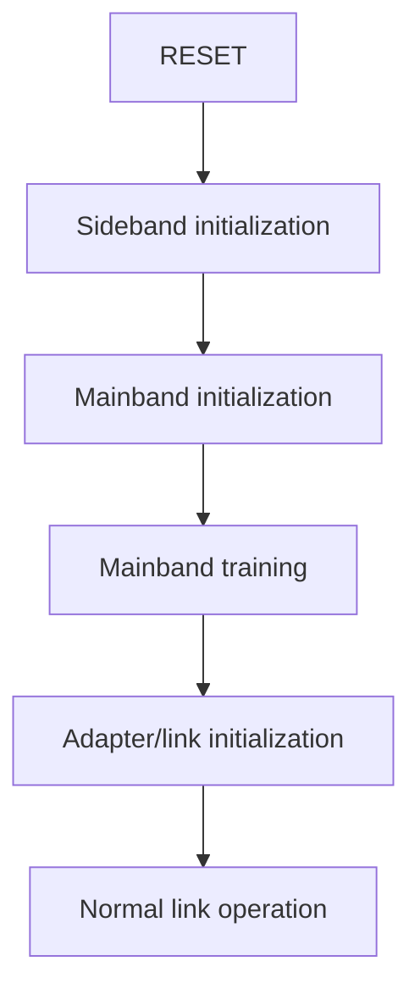

# Getting Started

## What UCIe is

Universal Chiplet Interconnect Express (UCIe) defines a die-to-die interconnect intended to let separately manufactured dies communicate inside one package. A multi-die design needs more than data wires: both ends must establish clocks, discover usable connectivity, train the link, exchange capabilities, and agree that the link is ready.

This project focuses on the control sequence for that bring-up process.

## Why chiplet links need training

Two connected dies cannot safely begin normal traffic immediately after reset. Their physical interfaces and control logic must first establish a usable sideband path, initialize and train the mainband, expose the link through the adapter interface, and handle failures or retraining requests.

The Link Training State Machine provides the ordering. It answers questions such as:

- What must happen after reset?
- Which initialization stage comes next?
- When may normal link operation begin?
- What happens if an operation takes too long?
- How does the controller leave a low-power state or retrain an active link?

## LTSM or LTSSM?

This repository uses **LTSM**, matching the UCIe source and the existing module names. The similar abbreviation **LTSSM** is widely associated with PCI Express. Both phrases refer to link-training state machines, but preserving `LTSM` avoids renaming the checked UCIe RTL.

## What this implementation teaches

The current milestone makes the control hierarchy visible:

Most internal physical procedures are represented by completion and error inputs. Version 0.3 makes one operation concrete in digital RTL: a 16-lane LFSR generator/checker control in `DATATRAINCENTER1`. This is useful for learning and verifying state control and pattern/error decisions, but it still does not implement the electrical or packet-level details of a full UCIe link.

## Suggested learning path

| Step | Read | Question answered |
|---|---|---|
| 1 | This page | Why does training exist? |
| 2 | [Glossary](../glossary.md) | What do the abbreviations and project terms mean? |
| 3 | [Architecture](../01_ucie_architecture/README.md) | Where is the boundary of the model? |
| 4 | [LTSM overview](../02_ltssm/README.md) | Which states and transitions exist? |
| 5 | [Algorithm](../03_algorithm/README.md) | How does the behavior work without RTL syntax? |
| 6 | [RTL guide](../04_rtl/README.md) | How is the behavior expressed in SystemVerilog? |
| 7 | [Verification](../05_verification/README.md) | What has actually been tested? |
| 8 | [Results](../06_results/README.md) | What evidence is available? |

## Reference boundary

The local reference is *UCIe Specification Revision 2.0, Version 1.0*, August 6, 2024. Relevant background is primarily in Section 4.5.3. Private copies and extracts are deliberately excluded from Git. Obtain the public specification from the [UCIe Consortium](https://www.uciexpress.org/specifications).
