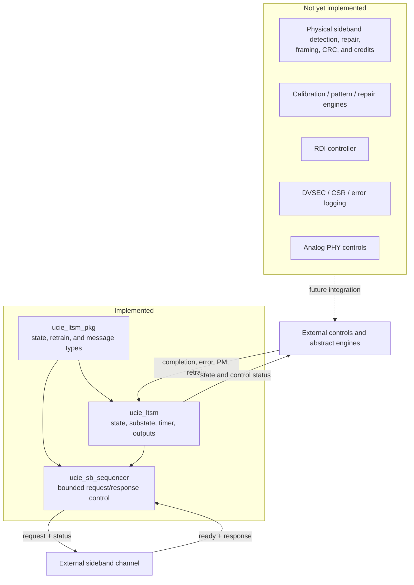

# Project Architecture

## Purpose

`ucie_ltsm` is a control-plane model. It sequences the top-level UCIe 2.0 LTSM states and the ordered MBINIT/MBTRAIN substates, controls a timer, integrates a bounded SBINIT sideband transaction, and exposes status outputs.

It presents a transaction-level ready/valid request and checks one expected response. It does not implement physical sideband detection, repair, framing, CRC, or credits, and it does not perform calibration. Remaining operations are represented by explicit inputs such as `phase_done_i`, `rdi_active_i`, and `error_handshake_done_i`.

## Current component boundary

## Control flow

1. RESET remains active until the minimum residence time and every required readiness input are satisfied.
2. SBINIT starts `SBINIT_DONE_REQ`; the expected response advances to MBINIT. The compatibility completion input can still bypass this exchange.
3. MBINIT and MBTRAIN advance when the abstract operation reports completion.
4. LINKINIT waits for `rdi_active_i` before entering ACTIVE.
5. ACTIVE can request PHY retraining or enter the combined L1/L2 power-management state.
6. Eligible states time out into TRAINERROR; fatal or sideband protocol errors can also enter TRAINERROR.
7. TRAINERROR returns to RESET when escalation is clear and the sideband transmitter is idle.

## Interface groups

| Group | Signals | Role |
|---|---|---|
| Clock/reset | `clk_i`, `rst_ni` | Sequential timing and asynchronous active-low reset |
| Reset release | `supplies_stable_i`, `sideband_clk_ok_i`, `internal_clks_ok_i`, `firmware_reset_i`, `link_train_trigger_i` | Gate the RESET-to-SBINIT transition after minimum residence |
| Abstract progress | `phase_done_i`, `stall_i`, `rdi_active_i` | Advance a phase, restart its timer, or complete LINKINIT |
| Sideband receive/accept | `sb_tx_ready_i`, `sb_rx_valid_i`, `sb_rx_message_i` | Accept the request and present the response |
| Sideband transmit/status | `sb_tx_valid_o`, `sb_tx_message_o`, `sb_busy_o`, `sb_retry_o`, `sb_protocol_error_o` | Present the request and expose sequencer progress/outcome |
| Error control | `fatal_error_i`, `error_handshake_done_i`, `error_escalated_i`, `sideband_tx_idle_i` | Enter and leave TRAINERROR |
| Retrain | `retrain_req_i`, `retrain_target_i` | Select the MBTRAIN re-entry point after PHYRETRAIN |
| Power management | `pm_l1_req_i`, `pm_l2_req_i`, `pm_exit_i` | Enter L1L2 and choose the L1 or L2 exit path |
| State/status | `state_o`, `mbinit_state_o`, `mbtrain_state_o`, `timeout_o`, `link_up_o` | Expose internal progress and link status |
| Physical controls | `mainband_tristate_o`, `sideband_enable_o` | Coarse control outputs derived from the top-level state |

The exact signal behavior is documented in [signals.md](../02_ltssm/signals.md). The synthesizable implementation is in [`rtl/ucie_ltsm.sv`](../../rtl/ucie_ltsm.sv).
