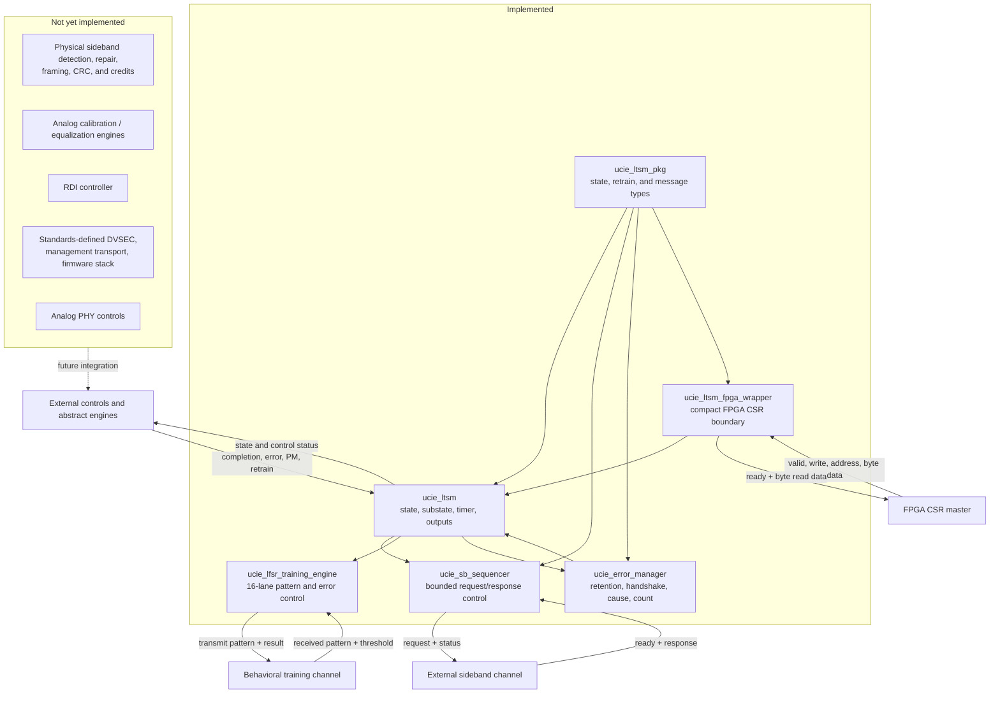

# Project Architecture

## Purpose

`ucie_ltsm` is a control-plane model. It sequences the top-level UCIe 2.0 LTSM states and the ordered MBINIT/MBTRAIN substates, controls a timer, integrates a bounded SBINIT sideband transaction, runs a digital 16-lane LFSR training engine in `MBT_DATATRAINCENTER1`, and retains/classifies accepted TRAINERROR events. `ucie_ltsm_fpga_wrapper` is a separate implementation boundary that keeps this reusable core unchanged while making its wide diagnostics available through a compact byte CSR.

It presents a transaction-level ready/valid request, checks one expected response, generates/checks a deterministic training pattern against a configurable error threshold, and retains digital error cause/count status. The wrapper exposes selected status to a simple same-cycle CSR request/response interface; it is not a standards-defined DVSEC or firmware stack. The project does not implement physical sideband detection, framing, CRC, credits, analog calibration, equalization, or BER qualification. Remaining operations are represented by explicit inputs such as `phase_done_i`, `rdi_active_i`, and `error_handshake_done_i`.

## Current component boundary

## Control flow

1. RESET remains active until the minimum residence time and every required readiness input are satisfied.
2. SBINIT starts `SBINIT_DONE_REQ`; the expected response advances to MBINIT. The compatibility completion input can still bypass this exchange.
3. MBINIT and most MBTRAIN substates advance when the abstract operation reports completion.
4. In `DATATRAINCENTER1`, the v0.3 engine emits 16 pattern bits from sixteen 23-bit LFSRs, advances only on accepted receive samples, saturates a 16-bit error count, and advances automatically only when `error_count < threshold`.
5. LINKINIT waits for `rdi_active_i` before entering ACTIVE.
6. ACTIVE can request PHY retraining or enter the combined L1/L2 power-management state.
7. The v0.4 error manager accepts one eligible state-timeout, sideband-protocol, or local-fatal event, retains it across short pulses, and applies fixed priority: state timeout, then sideband protocol, then local fatal.
8. State timeouts and SBINIT protocol errors enter TRAINERROR immediately. Other accepted faults assert a persistent handshake request and enter after acknowledgment or the configured manager bound.
9. Cause and a saturating 16-bit event count remain stable in TRAINERROR. Clear is ignored while pending or in TRAINERROR and works only in an allowed state.
10. TRAINERROR returns to RESET when escalation is clear and the sideband transmitter is idle; ordinary recovery does not erase the retained log.
11. At the FPGA boundary, addresses `0x00`-`0x09` read internal state/status/counters/version and `0x10[0]` requests the same protected core log clear. Undefined reads return zero and `csr_ready_o` follows `csr_valid_i` in the request cycle.

## Interface groups

| Group | Signals | Role |
|---|---|---|
| Clock/reset | `clk_i`, `rst_ni` | Sequential timing and asynchronous active-low reset |
| Reset release | `supplies_stable_i`, `sideband_clk_ok_i`, `internal_clks_ok_i`, `firmware_reset_i`, `link_train_trigger_i` | Gate the RESET-to-SBINIT transition after minimum residence |
| Abstract progress | `phase_done_i`, `stall_i`, `rdi_active_i` | Advance a phase, restart its timer, or complete LINKINIT |
| Sideband receive/accept | `sb_tx_ready_i`, `sb_rx_valid_i`, `sb_rx_message_i` | Accept the request and present the response |
| Sideband transmit/status | `sb_tx_valid_o`, `sb_tx_message_o`, `sb_busy_o`, `sb_retry_o`, `sb_protocol_error_o` | Present the request and expose sequencer progress/outcome |
| Training receive/configuration | `train_rx_valid_i`, `train_rx_pattern_i`, `train_error_threshold_i` | Accept received samples and configure the strict pass threshold |
| Training transmit/status | `train_tx_valid_o`, `train_tx_pattern_o`, `train_busy_o`, `train_done_o`, `train_pass_o`, `train_error_count_o` | Present the generated pattern and expose the current/final digital result |
| Error sources/control | `fatal_error_i`, `error_handshake_done_i`, `clear_error_log_i`, `error_escalated_i`, `sideband_tx_idle_i` | Accept, handshake, retain/clear, and release TRAINERROR events |
| Error status | `error_pending_o`, `trainerror_handshake_request_o`, `error_handshake_timeout_o`, `error_cause_o`, `error_event_count_o` | Expose the pending handshake, bounded timeout, retained cause, and saturating event count |
| Retrain | `retrain_req_i`, `retrain_target_i` | Select the MBTRAIN re-entry point after PHYRETRAIN |
| Power management | `pm_l1_req_i`, `pm_l2_req_i`, `pm_exit_i` | Enter L1L2 and choose the L1 or L2 exit path |
| State/status | `state_o`, `mbinit_state_o`, `mbtrain_state_o`, `timeout_o`, `link_up_o` | Expose internal progress and link status |
| Physical controls | `mainband_tristate_o`, `sideband_enable_o` | Coarse control outputs derived from the top-level state |
| FPGA CSR request | `csr_valid_i`, `csr_write_i`, `csr_addr_i`, `csr_wdata_i` | Select a wrapper read or write operation |
| FPGA CSR response | `csr_ready_o`, `csr_rdata_o` | Same-cycle acknowledgement and byte read data |

The exact signal behavior is documented in [signals.md](../02_ltssm/signals.md), the complete wrapper map is in the [FPGA CSR result](../06_results/fpga_csr_wrapper.md#csr-map), and abbreviation long forms are in the [project glossary](../glossary.md). The reusable integration is in [`rtl/ucie_ltsm.sv`](../../rtl/ucie_ltsm.sv); the fitted implementation boundary is [`rtl/ucie_ltsm_fpga_wrapper.sv`](../../rtl/ucie_ltsm_fpga_wrapper.sv).
