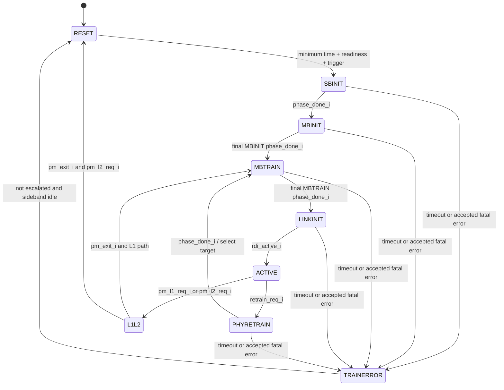

# Link Training State Machine

## State hierarchy

The controller has nine top-level states. MBINIT and MBTRAIN each carry a separate substate register, allowing the top-level encoding to remain small while preserving the ordered training steps.



Fatal errors can also move ACTIVE or L1L2 to TRAINERROR after the abstract error handshake completes. RESET ignores `fatal_error_i`. See [states.md](states.md) for the exact implemented conditions.

## Ordered substates

MBINIT:

```text
PARAM -> CAL -> REPAIRCLK -> REPAIRVAL -> REVERSALMB -> REPAIRMB
```

MBTRAIN:

```text
VALVREF -> DATAVREF -> SPEEDIDLE -> TXSELFCAL -> RXCLKCAL
-> VALTRAINCENTER -> VALTRAINVREF -> DATATRAINCENTER1
-> DATATRAINVREF -> RXDESKEW -> DATATRAINCENTER2
-> LINKSPEED -> REPAIR
```

These labels and order exist in the RTL. The project does not yet implement each label's physical operation; `phase_done_i` represents completion.

## Continue reading

- [States and transitions](states.md)
- [Signals](signals.md)
- [Timers and counters](timers_counters.md)
- [Behavioral algorithm and pseudocode](../03_algorithm/README.md)
- [RTL mapping](../04_rtl/README.md)
