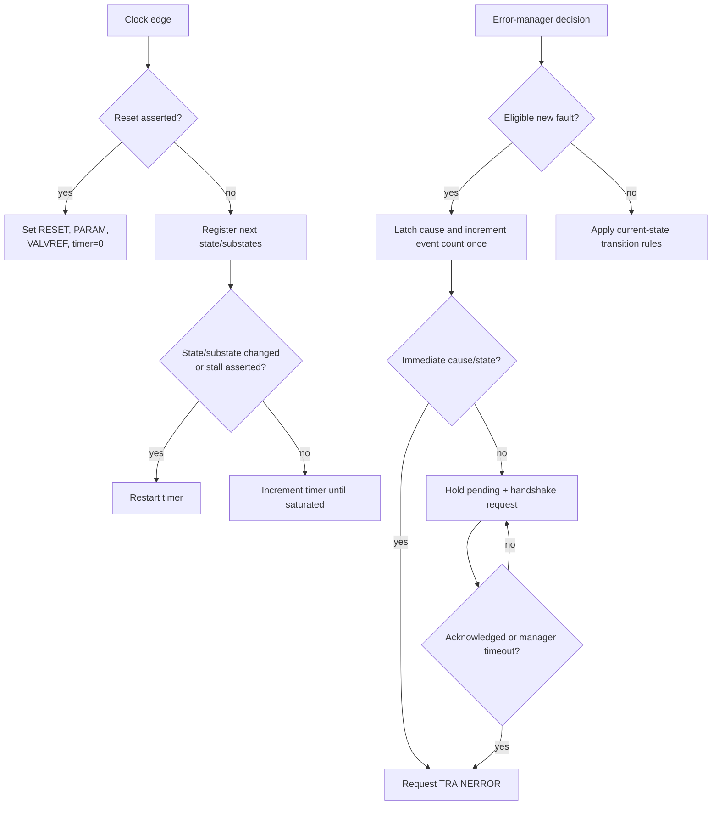

# Behavioral Algorithm and Pseudocode

## Problem

Link bring-up is a sequence of dependent operations. Later work must not start before earlier work completes, and a controller must recover when an eligible operation never finishes. The LTSM turns those requirements into an ordered control algorithm.

## Basic idea

The design stores three pieces of progress:

- a top-level state;
- an MBINIT substate; and
- an MBTRAIN substate.

One saturating counter measures RESET residence or the time spent in an eligible state/substate. A separate bounded sequencer performs the v0.2 SBINIT-done transaction. Version 0.3 adds a 16-lane, 23-bit LFSR training engine for `DATATRAINCENTER1`. Version 0.4 adds an error manager that accepts one event, retains it while a handshake is pending, classifies its cause, counts it once, and requests TRAINERROR at the required immediate/acknowledged/bounded point. A separate FPGA wrapper reads those internal diagnostics through a byte CSR without changing the control algorithm. External handshakes still abstract the remaining physical and training work.

## Behavioral flow



## Beginner-readable pseudocode

```text
on reset:
    top_state      = RESET
    mbinit_state   = PARAM
    mbtrain_state  = VALVREF
    timer          = 0

on each clock:
    save the selected next states

    if the top state changed,
       or an MBINIT/MBTRAIN substate changed,
       or stall is asserted:
        timer = 0
    else if timer is not saturated:
        timer = timer + 1

to choose the next state:
    keep every state unchanged by default

    if the error manager requests TRAINERROR:
        go to TRAINERROR
    else:
        case current top state:
            RESET:
                initialize both substates
                if minimum time and every readiness condition are satisfied:
                    go to SBINIT

            SBINIT:
                if the sideband response completed,
                   or the compatibility phase_done input is asserted:
                    go to MBINIT at PARAM

            MBINIT:
                if phase is done and not stalled:
                    advance to the next MBINIT substate
                    after REPAIRMB, go to MBTRAIN at VALVREF

            MBTRAIN:
                if phase is done,
                   or DATATRAINCENTER1 reports done and pass:
                    advance to the next MBTRAIN substate
                    after REPAIR, go to LINKINIT

            LINKINIT:
                if RDI is active:
                    go to ACTIVE

            ACTIVE:
                if retraining is requested:
                    go to PHYRETRAIN
                else if L1 or L2 is requested:
                    go to L1L2

            PHYRETRAIN:
                if phase is done:
                    go to MBTRAIN at the selected retrain target

            TRAINERROR:
                if error is not escalated and sideband transmit is idle:
                    go to RESET

            L1L2:
                if power-management exit is requested:
                    if the L2 request is still asserted:
                        go to RESET
                    else:
                        go to MBTRAIN at SPEEDIDLE

error manager:
    eligible = current state is neither RESET nor TRAINERROR

    if eligible and no event is pending and any fault is asserted:
        accept exactly one event
        retain cause using priority:
            state timeout, then sideband protocol, then local fatal
        increment the 16-bit event count unless it is already 16'hffff
        set pending

    if an eligible state timeout is asserted:
        request TRAINERROR immediately
    else if a sideband protocol error is asserted in SBINIT:
        request TRAINERROR immediately without a handshake
    else while an event is pending:
        keep the handshake request asserted
        if handshake_done is asserted or the manager timer reaches its bound:
            request TRAINERROR

    on TRAINERROR entry or RESET:
        clear pending and the manager timer

    if clear_log is asserted while no event is pending and state is not TRAINERROR:
        clear retained cause and event count
    otherwise:
        retain the cause and count

sideband sequencer:
    on start, latch SBINIT_DONE_REQ and expected SBINIT_DONE_RESP
    hold transmit-valid and the request until transmit-ready
    wait for a valid response
    if it matches, pulse done
    if it is wrong, pulse protocol_error
    if response timeout expires and retries remain, pulse retry and resend
    if the retry budget is exhausted, pulse protocol_error
    if abort is asserted, clear the outstanding transaction

DATATRAINCENTER1 LFSR engine:
    on start:
        load 16 lane LFSRs from eight seeds repeated modulo eight
        clear sample count and saturated error count

    while busy:
        drive each transmit-pattern bit from its lane LFSR
        only when receive-valid is asserted:
            compare the received pattern with the expected pattern
            add the mismatch popcount with 16-bit saturation
            advance every 23-bit LFSR once
            count one accepted sample

    on the configured final accepted sample:
        pulse done
        pass only when accumulated error count is strictly below threshold

    on abort or reset:
        clear busy, result, count, and lane state

FPGA CSR wrapper:
    pass functional control, sideband, and training ports to the unchanged core
    keep wide state/error/training diagnostics internal

    when csr_valid and read:
        decode address 0x00 through 0x09 into one status byte
        return zero for an undefined address

    when csr_valid and write and address is 0x10 and wdata[0] is one:
        request error-log clear from the core
        rely on the error manager to ignore the request while pending or in TRAINERROR

    acknowledge a valid CSR request in the same cycle
```

## Mapping to RTL concepts

| Algorithm idea | SystemVerilog mechanism |
|---|---|
| Remember progress | `state_q`, `mbi_q`, and `mbt_q` registers in `always_ff` |
| Select the next step | Defaults plus `unique case` in `always_comb` |
| Measure residence | Saturating `timer_q` register |
| Restart per operation | `state_changed`, `substate_changed`, or `stall_i` |
| Express status | Continuous assignments for `timeout_o`, `link_up_o`, and physical-control outputs |
| Encode legal labels | Enumerated types in `ucie_ltsm_pkg` |
| Sequence SBINIT exchange | `ucie_sb_sequencer` registered SEND/WAIT/error control |
| Bound response waiting | Sequencer timer and retry-count registers |
| Generate per-lane training pattern | Sixteen `lane_lfsr_q` registers and the `lfsr_next` function |
| Count received mismatches | `bit_errors` popcount plus a saturating 16-bit accumulator |
| Decide training result | Strict `accumulated_errors < error_threshold_i` comparison |
| Accept and retain one error event | `ucie_error_manager` acceptance gate plus `pending_o` |
| Classify simultaneous causes | Fixed timeout → sideband → local-fatal priority |
| Bound a missing acknowledgment | Error-manager handshake timer |
| Preserve diagnostic history | Registered `cause_o` and saturating `event_count_o` |
| Protect log clearing | Clear accepted only while not pending and outside TRAINERROR |
| Reduce the FPGA pin boundary | `ucie_ltsm_fpga_wrapper` keeps wide diagnostic buses internal |
| Read compact FPGA status | Combinational `0x00`-`0x09` CSR decode |
| Request protected clear | `0x10[0]` write mapped to `clear_error_log_i` |

The next page explains the source organization: [RTL guide](../04_rtl/README.md).
