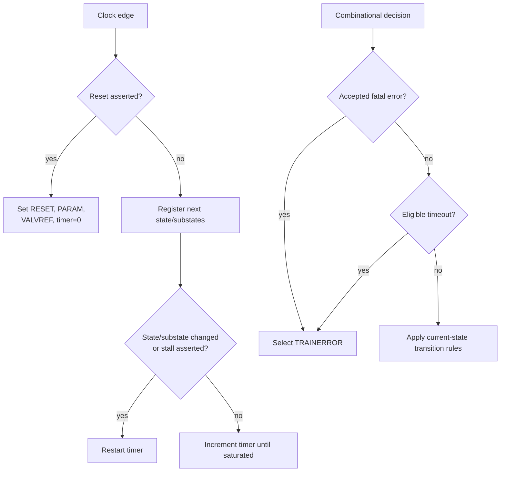

# Behavioral Algorithm and Pseudocode

## Problem

Link bring-up is a sequence of dependent operations. Later work must not start before earlier work completes, and a controller must recover when an eligible operation never finishes. The LTSM turns those requirements into an ordered control algorithm.

## Basic idea

The design stores three pieces of progress:

- a top-level state;
- an MBINIT substate; and
- an MBTRAIN substate.

One saturating counter measures RESET residence or the time spent in an eligible state/substate. External handshakes abstract the physical and protocol work performed around the controller.

## Behavioral flow



## Beginner-readable pseudocode

```text
on reset:
    top_state      = RESET
    mbinit_state   = PARAM
    mbtrain_state  = VALVREF
    timer          = 0

on each clock:
    save the selected next states

    if the top state changed,
       or an MBINIT/MBTRAIN substate changed,
       or stall is asserted:
        timer = 0
    else if timer is not saturated:
        timer = timer + 1

to choose the next state:
    keep every state unchanged by default

    if fatal_error is asserted outside RESET:
        if current state is SBINIT,
           or the error handshake completed,
           or timeout is active:
            go to TRAINERROR
    else if an eligible timeout is active:
        go to TRAINERROR
    else:
        case current top state:
            RESET:
                initialize both substates
                if minimum time and every readiness condition are satisfied:
                    go to SBINIT

            SBINIT:
                if phase is done:
                    go to MBINIT at PARAM

            MBINIT:
                if phase is done and not stalled:
                    advance to the next MBINIT substate
                    after REPAIRMB, go to MBTRAIN at VALVREF

            MBTRAIN:
                if phase is done:
                    advance to the next MBTRAIN substate
                    after REPAIR, go to LINKINIT

            LINKINIT:
                if RDI is active:
                    go to ACTIVE

            ACTIVE:
                if retraining is requested:
                    go to PHYRETRAIN
                else if L1 or L2 is requested:
                    go to L1L2

            PHYRETRAIN:
                if phase is done:
                    go to MBTRAIN at the selected retrain target

            TRAINERROR:
                if error is not escalated and sideband transmit is idle:
                    go to RESET

            L1L2:
                if power-management exit is requested:
                    if the L2 request is still asserted:
                        go to RESET
                    else:
                        go to MBTRAIN at SPEEDIDLE
```

## Mapping to RTL concepts

| Algorithm idea | SystemVerilog mechanism |
|---|---|
| Remember progress | `state_q`, `mbi_q`, and `mbt_q` registers in `always_ff` |
| Select the next step | Defaults plus `unique case` in `always_comb` |
| Measure residence | Saturating `timer_q` register |
| Restart per operation | `state_changed`, `substate_changed`, or `stall_i` |
| Express status | Continuous assignments for `timeout_o`, `link_up_o`, and physical-control outputs |
| Encode legal labels | Enumerated types in `ucie_ltsm_pkg` |

The next page explains the source organization: [RTL guide](../04_rtl/README.md).
