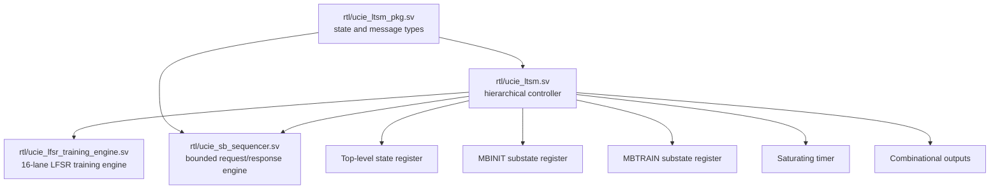

# RTL Implementation

## Module hierarchy

There are three synthesizable modules and one package. Version 0.2 added the bounded SBINIT transaction sequencer; version 0.3 adds one digital LFSR training engine. No physical sideband, RDI controller, CSR block, analog calibration, or analog-PHY module exists.

The diagram shows the controller-to-training start/abort and result paths, the receive/training interface, and the exact digital-only scope boundary. The v0.2 sideband diagram remains available in the [v0.2 milestone page](../versions/v0.2_sideband.md).

## `ucie_ltsm_pkg.sv`

[`rtl/ucie_ltsm_pkg.sv`](../../rtl/ucie_ltsm_pkg.sv) defines:

- `ltsm_state_e`: nine explicit 4-bit top-level encodings;
- `mbinit_state_e`: six ordered 3-bit labels;
- `mbtrain_state_e`: thirteen ordered 4-bit labels; and
- `retrain_target_e`: the three modeled retrain destinations; and
- `sb_msg_e`: `NOP`, `SBINIT_DONE_REQ`, and `SBINIT_DONE_RESP` transaction labels.

The names are the contract shared by RTL and verification.

## `ucie_ltsm.sv`

[`rtl/ucie_ltsm.sv`](../../rtl/ucie_ltsm.sv) contains four main implementation parts.

### 1. Parameter conversion and engine integration

`CLK_HZ`, `RESET_MIN_US`, and `TIMEOUT_US` are converted into tick counts. The checked default `CLK_HZ` is 80 MHz so it matches the Quartus 12.5 ns constraint. The testbenches override it to 100 MHz for their 10 ns clock. `SB_RESPONSE_TIMEOUT_CYCLES` and `SB_MAX_RETRIES` configure the sideband sequencer; `DATATRAIN_SAMPLE_COUNT` configures the LFSR engine and defaults to 4096 accepted samples.

### 2. Continuous status logic

Continuous assignments compare current and next state, enable timeout only in selected states, and derive `link_up_o`, `mainband_tristate_o`, and `sideband_enable_o`.

### 3. Sequential state and timer registers

The `always_ff` block performs asynchronous reset, registers next-state decisions, restarts the timer on a state/substate change or stall, and otherwise increments it with saturation.

### 4. Combinational next-state logic

The `always_comb` block starts with hold-current-state defaults. It then applies fatal-error priority, timeout priority, and the normal state-specific transition rules.

SBINIT accepts either the compatibility `phase_done_i` path or the sequencer completion pulse. An asserted sideband protocol error participates in the global error-priority condition and drives SBINIT to TRAINERROR. Leaving SBINIT asserts the sequencer's internal abort input.

In `MBT_DATATRAINCENTER1`, a training completion advances to `MBT_DATATRAINVREF` only when `train_done_o && train_pass_o`. A failed completion remains in the same substate and starts a new attempt after the one-cycle result pulse. `phase_done_i` remains a compatibility bypass and aborts the engine after leaving the substate.

## `ucie_sb_sequencer.sv`

[`rtl/ucie_sb_sequencer.sv`](../../rtl/ucie_sb_sequencer.sv) implements a small registered transaction machine:

- IDLE latches the requested and expected message labels;
- SEND holds transmit valid and the request until ready;
- WAIT matches the response and counts a response timeout;
- a remaining retry returns to SEND and pulses `retry_o`; and
- an unexpected response or exhausted budget pulses `protocol_error_o` and enters the terminal error condition.

`abort_i` clears an outstanding transaction when the parent LTSM is no longer in SBINIT. The module is transaction-level control logic; it does not serialize a physical sideband packet.

## `ucie_lfsr_training_engine.sv`

[`rtl/ucie_lfsr_training_engine.sv`](../../rtl/ucie_lfsr_training_engine.sv) implements the v0.3 digital training operation:

- sixteen 23-bit lane LFSRs initialized from eight seeds repeated modulo eight;
- Fibonacci feedback for `X^23 + X^21 + X^16 + X^8 + X^5 + X^2 + 1`;
- a 16-bit transmit pattern formed from the lane-state most-significant bits;
- state advance only when a receive sample is valid;
- mismatch popcount and a 16-bit saturating error accumulator;
- a configurable accepted-sample count, defaulting to 4096; and
- one-cycle `done_o` with `pass_o` true only for strict `error_count < error_threshold_i`.

This is synthesizable digital pattern/control logic. It does not create analog waveforms, train voltage or phase, estimate BER, or model a physical channel.

## Design choices visible in the source

- Hierarchical substates avoid flattening every MBINIT/MBTRAIN step into the top-level enum.
- `phase_done_i` deliberately separates control sequencing from physical-operation implementation.
- The new ready/valid sequencer replaces that abstraction only for the normal SBINIT-done exchange; the compatibility bypass remains.
- The v0.3 engine replaces the abstraction only for a successful `DATATRAINCENTER1` result; the compatibility bypass remains for integration and abort testing.
- Counter saturation avoids wraparound after a long residence.
- Outputs are Moore-style functions of the registered top-level state, except `sideband_enable_o`, which can also reflect sideband clock readiness while in RESET.

## Integration cautions

- External asynchronous inputs would require synchronization in a real clock-domain integration; synchronization is outside this module.
- The completion and request inputs are treated as levels sampled by next-state logic. Their producing blocks must define pulse width and deassertion behavior.
- The two power-management requests share one `LTSM_L1L2` encoding; the still-asserted `pm_l2_req_i` selects the RESET exit.
- The current controller exposes control intent, not a complete UCIe physical interface.
- Sideband inputs must be synchronous to `clk_i` or synchronized externally, and the external channel must define ready/valid stability rules compatible with this interface.
