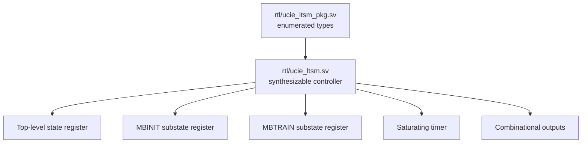

# RTL Implementation

## Module hierarchy

There is one synthesizable module and one package. No sideband, RDI, training-engine, CSR, or analog-PHY module exists in this milestone.

The diagram groups the exact public inputs and outputs and shows the four internal control partitions used in the source. Its scope box distinguishes absent future integration blocks from current RTL.

## `ucie_ltsm_pkg.sv`

[`rtl/ucie_ltsm_pkg.sv`](../../rtl/ucie_ltsm_pkg.sv) defines:

- `ltsm_state_e`: nine explicit 4-bit top-level encodings;
- `mbinit_state_e`: six ordered 3-bit labels;
- `mbtrain_state_e`: thirteen ordered 4-bit labels; and
- `retrain_target_e`: the three modeled retrain destinations.

The names are the contract shared by RTL and verification.

## `ucie_ltsm.sv`

[`rtl/ucie_ltsm.sv`](../../rtl/ucie_ltsm.sv) contains four main implementation parts.

### 1. Parameter conversion

`CLK_HZ`, `RESET_MIN_US`, and `TIMEOUT_US` are converted into tick counts. The checked default `CLK_HZ` is 80 MHz so it matches the Quartus 12.5 ns constraint. The testbenches override it to 100 MHz for their 10 ns clock.

### 2. Continuous status logic

Continuous assignments compare current and next state, enable timeout only in selected states, and derive `link_up_o`, `mainband_tristate_o`, and `sideband_enable_o`.

### 3. Sequential state and timer registers

The `always_ff` block performs asynchronous reset, registers next-state decisions, restarts the timer on a state/substate change or stall, and otherwise increments it with saturation.

### 4. Combinational next-state logic

The `always_comb` block starts with hold-current-state defaults. It then applies fatal-error priority, timeout priority, and the normal state-specific transition rules.

## Design choices visible in the source

- Hierarchical substates avoid flattening every MBINIT/MBTRAIN step into the top-level enum.
- `phase_done_i` deliberately separates control sequencing from physical-operation implementation.
- Counter saturation avoids wraparound after a long residence.
- Outputs are Moore-style functions of the registered top-level state, except `sideband_enable_o`, which can also reflect sideband clock readiness while in RESET.

## Integration cautions

- External asynchronous inputs would require synchronization in a real clock-domain integration; synchronization is outside this module.
- The completion and request inputs are treated as levels sampled by next-state logic. Their producing blocks must define pulse width and deassertion behavior.
- The two power-management requests share one `LTSM_L1L2` encoding; the still-asserted `pm_l2_req_i` selects the RESET exit.
- The current controller exposes control intent, not a complete UCIe physical interface.
