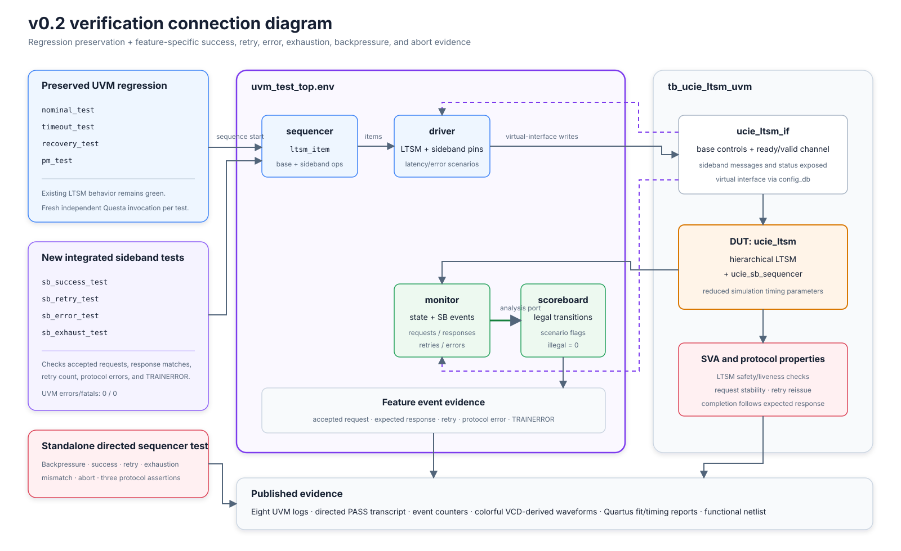
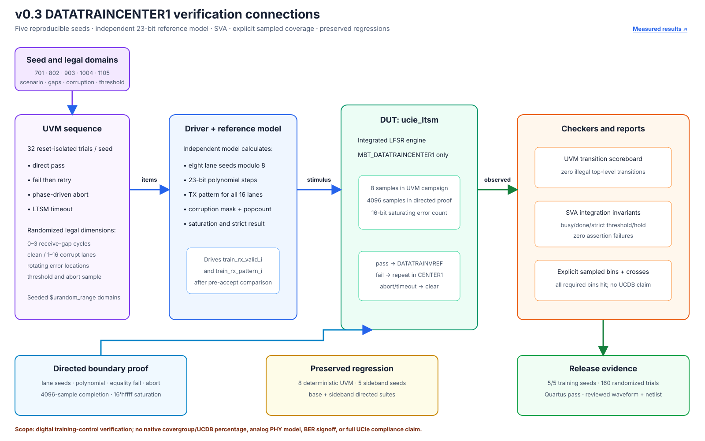
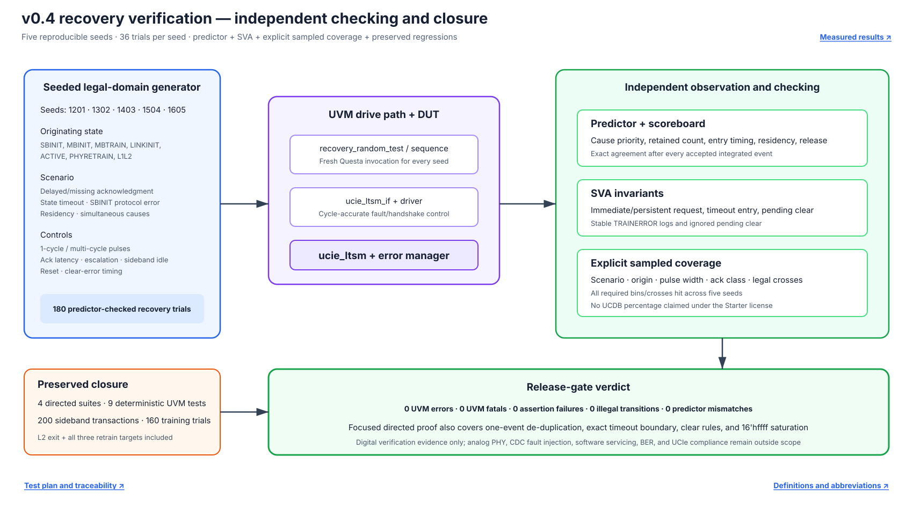
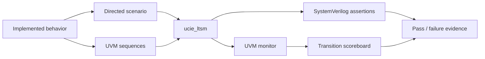
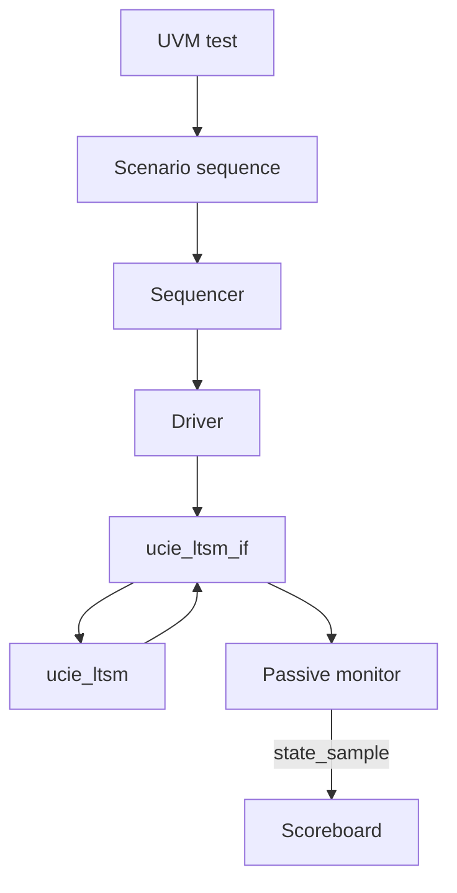

# Verification

The project uses a self-checking directed test first, followed by a reusable UVM environment. Assertions run alongside both testbench tops.

The verification-only `v0.2-random-uvm` update adds the following seeded flow without changing the DUT:

Version 0.3 extends the same environment with an independent LFSR reference model, training-specific SVA, explicit sampled functional-coverage bins/crosses, a focused 4096-sample boundary test, and five reproducible seeds:

Version 0.4 adds an independent recovery predictor, error-retention SVA, explicit scenario/origin/pulse/ack coverage, a focused 65,536-event saturation proof, and a dedicated FPGA CSR wrapper test:

## Verification flow

## Directed verification

[`verification/tb_ucie_ltsm.sv`](../../verification/tb_ucie_ltsm.sv) performs one deterministic scenario:

1. Apply reset and readiness inputs.
2. Reach SBINIT, pulse completion into MBINIT, then advance six MBINIT and thirteen MBTRAIN operations.
3. Assert RDI active and require ACTIVE.
4. Request PHY retraining and require MBTRAIN/`SPEEDIDLE` re-entry.
5. Inject a fatal error with the error handshake complete.
6. Require TRAINERROR and then RESET.

Every explicit checkpoint uses `$fatal` on mismatch. The pass condition is the final message `PASS: nominal training, retrain, and error recovery` with no earlier fatal error.

Additional self-checking directed tops isolate the sideband sequencer, LFSR engine, v0.4 error manager, and FPGA CSR wrapper. The wrapper test reads version/state/status, injects a one-cycle fatal event, reads retained cause/count, proves a TRAINERROR clear is ignored, proves a post-recovery clear succeeds, and checks an undefined address returns zero.

## UVM architecture

All UVM classes are currently collected in [`verification/uvm/ucie_ltsm_uvm_pkg.sv`](../../verification/uvm/ucie_ltsm_uvm_pkg.sv). This is compact for the current scale; the repository does not pretend they are already split into separate component files.

Implemented UVM components:

- operation sequence item and sequencer;
- driver for start, completion, timeout wait, retrain, fatal-error, stall, PM, and sideband response operations;
- passive top-level-state transition and sideband-event monitor;
- scoreboard that rejects transitions outside the modeled top-level graph;
- agent and environment;
- nominal, timeout, recovery, PM, sideband success, sideband retry, malformed-response, and retry-exhaustion sequences/tests.
- a reset-isolated `sb_random_test` with explicit outcome/timing domains, a cumulative predictor, and end-of-test monitor comparison.
- a reset-isolated `datatrain_random_test` with independent lane/polynomial prediction, corruption/gap/threshold domains, retry/abort/timeout scenarios, and explicit sampled coverage bins.
- a deterministic `recovery_closure_test` for the L2 exit and all three retrain targets.
- a reset-isolated `recovery_random_test` with an independent cause/count/entry/residency predictor and explicit scenario/origin/pulse/ack coverage.

## Current UVM scenarios

| Test | Objective | Key expected observation | Fresh result |
|---|---|---|---|
| `nominal_test` | Initialize from RESET to ACTIVE | Scoreboard sees ACTIVE and no illegal transition | Pass |
| `timeout_test` | Leave SBINIT through timeout | Scoreboard sees TRAINERROR | Pass |
| `recovery_test` | Exercise retrain, SPEEDIDLE re-entry, and fatal-error recovery | Scoreboard sees PHYRETRAIN and TRAINERROR | Pass |
| `pm_test` | Exercise L1 entry and exit | Scoreboard sees L1L2; RTL returns through MBTRAIN | Pass |
| `sb_success_test` | Complete SBINIT through the expected response | One accepted request and successful MBINIT entry | Pass |
| `sb_retry_test` | Withhold the first response and then complete | Two accepted requests, one retry, successful MBINIT entry | Pass |
| `sb_error_test` | Return an unexpected response | Protocol error and TRAINERROR observed | Pass |
| `sb_exhaust_test` | Withhold both response opportunities | One retry, protocol error, and TRAINERROR observed | Pass |
| `sb_random_test` | Randomize four legal outcomes and independent 1-3 cycle delays across five seeds | Every outcome hit; predictor totals match monitor; no illegal transition | Pass (5/5 seeds) |
| `datatrain_random_test` | Randomize DATATRAINCENTER1 pass, fail/retry, abort, timeout, receive gaps, corrupt lanes/locations, and thresholds | Exact LFSR/count/result matches; all required bins/crosses hit; zero assertion failure | Pass (5/5 seeds) |
| `recovery_closure_test` | Close L2 exit and all three PHYRETRAIN targets | L2 selects RESET; TXSELFCAL/SPEEDIDLE/REPAIR select exact MBTRAIN restart | Pass |
| `recovery_random_test` | Randomize six recovery scenarios across seven eligible origins with pulse, acknowledgment, residency, and clear controls | Exact cause/count/entry/release predictor agreement; all required bins/crosses hit | Pass (5/5 seeds) |

See [testplan.md](testplan.md) for exact coverage and missing scenarios.

## Assertions and cover property

[`verification/ucie_ltsm_sva.sv`](../../verification/ucie_ltsm_sva.sv) contains:

| Property | Checks |
|---|---|
| `ap_link_up_only_active` | `link_up_i` implies ACTIVE in the same sampled cycle |
| `ap_timeout_to_error` | A timeout is followed by TRAINERROR |
| `ap_no_reset_direct_active` | RESET cannot transition directly to ACTIVE |
| `ap_known_state` | The top-level state has no unknown bits |
| `cp_reaches_active` | Covers eventual RESET-to-ACTIVE reachability in a run |
| `ap_training_only_center1` | Training busy is confined to DATATRAINCENTER1 plus the defined abort cycle |
| `ap_done_is_pulse` / `ap_done_not_busy` | Training completion is one cycle and is not busy |
| `ap_pass_is_strict` / `ap_fail_at_threshold` | Pass/fail obeys the strict threshold relationship |
| `ap_hold_without_sample` | The error count holds when no receive sample is accepted |
| `cp_training_pass` / `cp_training_fail` | Both completed result classes occur |
| `ap_error_request_immediate` / `ap_error_request_persistent` | Eligible fatal events request immediately and remain requested while pending |
| `ap_error_timeout_to_trainerror` | The manager bound causes TRAINERROR when acknowledgment is absent |
| `ap_error_pending_clears` | Pending state clears on TRAINERROR entry |
| `ap_trainerror_log_stable` / `ap_pending_clear_ignored` | Retained cause/count remain stable and protected at the required times |

## Coverage boundary

Questa Starter cannot license native covergroups or class `randomize()`. The campaigns therefore use seeded legal-domain selection and explicit sampled bins/crosses. v0.3 reports training outcome/error/gap/threshold coverage; v0.4 reports six recovery scenarios, seven origin categories, pulse/ack classes, and legal crosses. No native UCDB percentage is claimed. The evidence still does not prove every MBINIT/MBTRAIN substate timeout, every sideband message, asynchronous CDC behavior, or any analog/channel condition.

Detailed counts, commands, and limitations are in the [DATATRAINCENTER1 results](../06_results/datatrain_lfsr.md), [recovery results](../06_results/error_recovery.md), and [FPGA wrapper result](../06_results/fpga_csr_wrapper.md). Terminology is defined in the [project glossary](../glossary.md).
