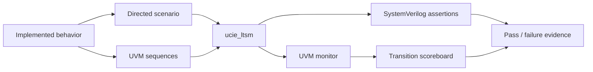
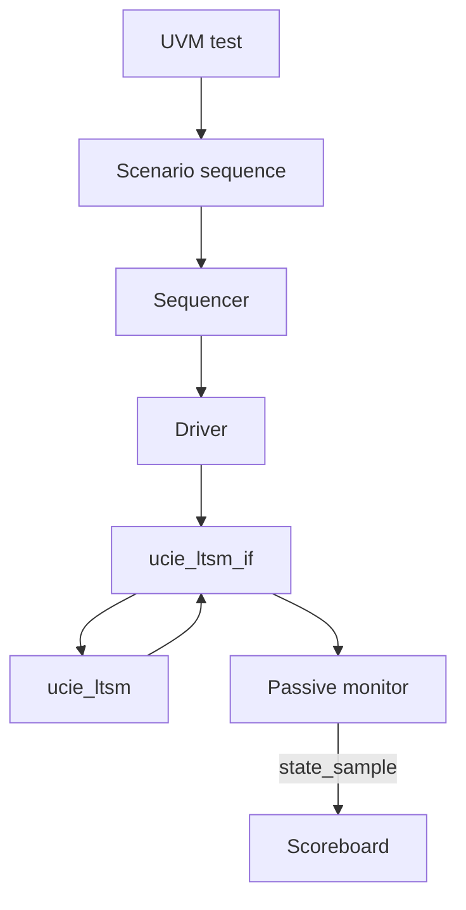

# Verification

The project uses a self-checking directed test first, followed by a reusable UVM environment. Assertions run alongside both testbench tops.

The verification-only `v0.2-random-uvm` update adds the following seeded flow without changing the DUT:

## Verification flow

## Directed verification

[`verification/tb_ucie_ltsm.sv`](../../verification/tb_ucie_ltsm.sv) performs one deterministic scenario:

1. Apply reset and readiness inputs.
2. Reach SBINIT, pulse completion into MBINIT, then advance six MBINIT and thirteen MBTRAIN operations.
3. Assert RDI active and require ACTIVE.
4. Request PHY retraining and require MBTRAIN/`SPEEDIDLE` re-entry.
5. Inject a fatal error with the error handshake complete.
6. Require TRAINERROR and then RESET.

Every explicit checkpoint uses `$fatal` on mismatch. The pass condition is the final message `PASS: nominal training, retrain, and error recovery` with no earlier fatal error.

## UVM architecture

All UVM classes are currently collected in [`verification/uvm/ucie_ltsm_uvm_pkg.sv`](../../verification/uvm/ucie_ltsm_uvm_pkg.sv). This is compact for the current scale; the repository does not pretend they are already split into separate component files.

Implemented UVM components:

- operation sequence item and sequencer;
- driver for start, completion, timeout wait, retrain, fatal-error, stall, PM, and sideband response operations;
- passive top-level-state transition and sideband-event monitor;
- scoreboard that rejects transitions outside the modeled top-level graph;
- agent and environment;
- nominal, timeout, recovery, PM, sideband success, sideband retry, malformed-response, and retry-exhaustion sequences/tests.
- a reset-isolated `sb_random_test` with explicit outcome/timing domains, a cumulative predictor, and end-of-test monitor comparison.

## Current UVM scenarios

| Test | Objective | Key expected observation | Fresh result |
|---|---|---|---|
| `nominal_test` | Initialize from RESET to ACTIVE | Scoreboard sees ACTIVE and no illegal transition | Pass |
| `timeout_test` | Leave SBINIT through timeout | Scoreboard sees TRAINERROR | Pass |
| `recovery_test` | Exercise retrain, SPEEDIDLE re-entry, and fatal-error recovery | Scoreboard sees PHYRETRAIN and TRAINERROR | Pass |
| `pm_test` | Exercise L1 entry and exit | Scoreboard sees L1L2; RTL returns through MBTRAIN | Pass |
| `sb_success_test` | Complete SBINIT through the expected response | One accepted request and successful MBINIT entry | Pass |
| `sb_retry_test` | Withhold the first response and then complete | Two accepted requests, one retry, successful MBINIT entry | Pass |
| `sb_error_test` | Return an unexpected response | Protocol error and TRAINERROR observed | Pass |
| `sb_exhaust_test` | Withhold both response opportunities | One retry, protocol error, and TRAINERROR observed | Pass |
| `sb_random_test` | Randomize four legal outcomes and independent 1-3 cycle delays across five seeds | Every outcome hit; predictor totals match monitor; no illegal transition | Pass (5/5 seeds) |

See [testplan.md](testplan.md) for exact coverage and missing scenarios.

## Assertions and cover property

[`verification/ucie_ltsm_sva.sv`](../../verification/ucie_ltsm_sva.sv) contains:

| Property | Checks |
|---|---|
| `ap_link_up_only_active` | `link_up_i` implies ACTIVE in the same sampled cycle |
| `ap_timeout_to_error` | A timeout is followed by TRAINERROR |
| `ap_no_reset_direct_active` | RESET cannot transition directly to ACTIVE |
| `ap_known_state` | The top-level state has no unknown bits |
| `cp_reaches_active` | Covers eventual RESET-to-ACTIVE reachability in a run |

## Coverage boundary

There are no functional covergroups and no checked-in UCDB/coverage report. The randomized campaign records explicit scenario hits and predictor-checked event counters, not a coverage percentage. The evidence does not prove every MBINIT/MBTRAIN substate, every timeout location, all retrain targets, every sideband message, or every error combination.
