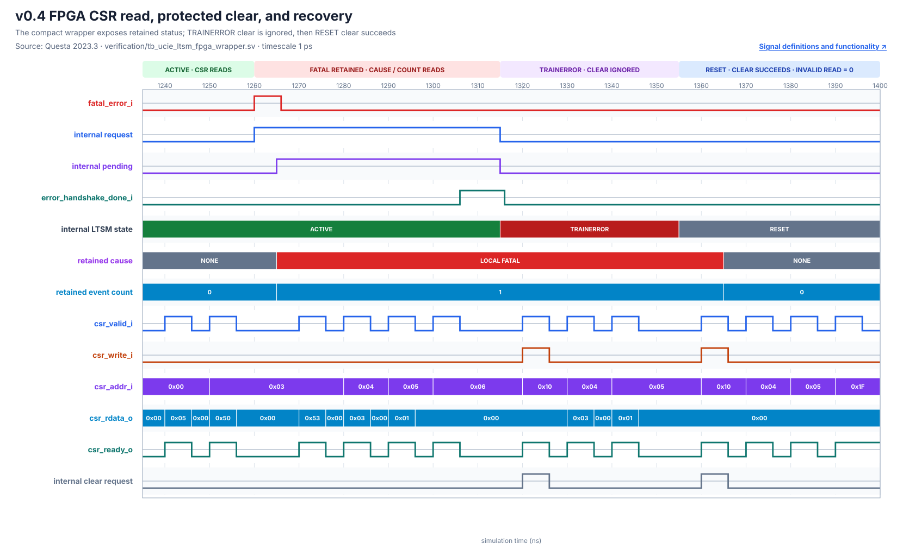

# FPGA CSR Wrapper Verification

## Purpose

`ucie_ltsm_fpga_wrapper` keeps the verified v0.4 controller unchanged while replacing wide physical diagnostic/status outputs with a compact byte-wide CSR interface. The wrapper reduces the selected FPGA package use from the unfittable 149-pin controller top to 119 pins without using virtual pins.

## CSR map

| Address | Access | Contents |
|---:|---|---|
| `0x00` | RO | LTSM state |
| `0x01` | RO | MBINIT substate |
| `0x02` | RO | MBTRAIN substate |
| `0x03` | RO | `[7]=0`, `[6]=sideband enable`, `[5]=mainband tristate`, `[4]=link up`, `[3]=LTSM timeout`, `[2]=handshake timeout`, `[1]=handshake request`, `[0]=error pending` |
| `0x04` | RO | Retained error cause |
| `0x05` | RO | Error event count bits 7:0 |
| `0x06` | RO | Error event count bits 15:8 |
| `0x07` | RO | Training error count bits 7:0 |
| `0x08` | RO | Training error count bits 15:8 |
| `0x09` | RO | Wrapper version (`0x04`) |
| `0x10` | WO | Bit 0 requests error-log clear |

`csr_ready_o` acknowledges a valid request in the same cycle. Undefined reads return zero. Writes other than `0x10[0]` are acknowledged and ignored. The core itself remains the reusable ASIC-facing module; this wrapper is the FPGA implementation boundary.


## Verification

The self-checking wrapper test reaches ACTIVE, reads state/status/version, injects a one-cycle fatal event, checks immediate handshake through internal observation, reads the retained cause/count through CSR, proves clear is ignored in TRAINERROR, releases recovery, proves clear succeeds in RESET, and checks an undefined address. It passed with zero Questa compilation or simulation errors.

The preserved gate also passed in fresh invocations:

- nine deterministic UVM tests;
- five sideband seeds / 200 transactions;
- five DATATRAINCENTER1 seeds / 160 trials;
- five recovery seeds / 180 trials; and
- controller, sideband, LFSR and error-manager directed suites.



The waveform is rendered from the wrapper test's Questa VCD. Its signal labels link to the [FPGA CSR signal guide](../02_ltssm/signals.md#v04-fpga-csr-signal-guide).

## Quartus result

Quartus Prime Lite 23.1std.1 full compilation passed for Cyclone 10 LP `10CL025YU256C8G`:

- 804 logic elements (3%);
- 499 registers;
- 119 physical pins (79%);
- zero virtual pins;
- worst setup slack `+0.624 ns` at the slow 85 C corner;
- worst hold slack `+0.178 ns` across analyzed corners; and
- zero setup/hold TNS for `clk_i` at 80 MHz.

The design is not fully constrained because board pin assignments and external I/O delays are not defined. These numbers qualify the internal FPGA core clock only, not board timing, ASIC timing or UCIe link rate.

Warnings include constant unused sideband message bits, unused CSR write-data bits 7:1, missing exact pin locations/I/O delays, the Lite-edition LogicLock limitation and the existing parameter-width truncation warning in `ucie_error_manager`. None prevented fitting or analyzed internal-clock timing.

Selected compact summaries are retained under [`quartus/output_files_wrapper`](../../quartus/output_files_wrapper/). The reviewed release-boundary functional netlist is [`ucie_ltsm_fpga_wrapper.vo`](../../synthesis/quartus/netlists/v0.4-error-recovery/ucie_ltsm_fpga_wrapper.vo), SHA-256 `102231FB12CEA16D83070312EFF10FC04A95E0C85D297AE48ABB5D1515D13B52`; see the [netlist manifest](../../synthesis/quartus/netlists/v0.4-error-recovery/README.md).

## Commands

```powershell
vsim -c -do scripts/run_fpga_wrapper_directed.do
vsim -c -do scripts/capture_fpga_wrapper_waveform.do
python scripts/render_error_waveforms.py
quartus_sh --flow compile ucie_ltsm_fpga
.\scripts\export_quartus_netlist.ps1 -Version v0.4-error-recovery -Project ucie_ltsm_fpga -OutputName ucie_ltsm_fpga_wrapper.vo
.\scripts\run_uvm_regression.ps1
.\scripts\run_random_regression.ps1
.\scripts\run_datatrain_random_regression.ps1
.\scripts\run_recovery_random_regression.ps1
```

This result supports the digital controller/CSR FPGA checkpoint only. It does not establish analog PHY behavior, board timing, ASIC timing, BER, interoperability, or UCIe compliance.
