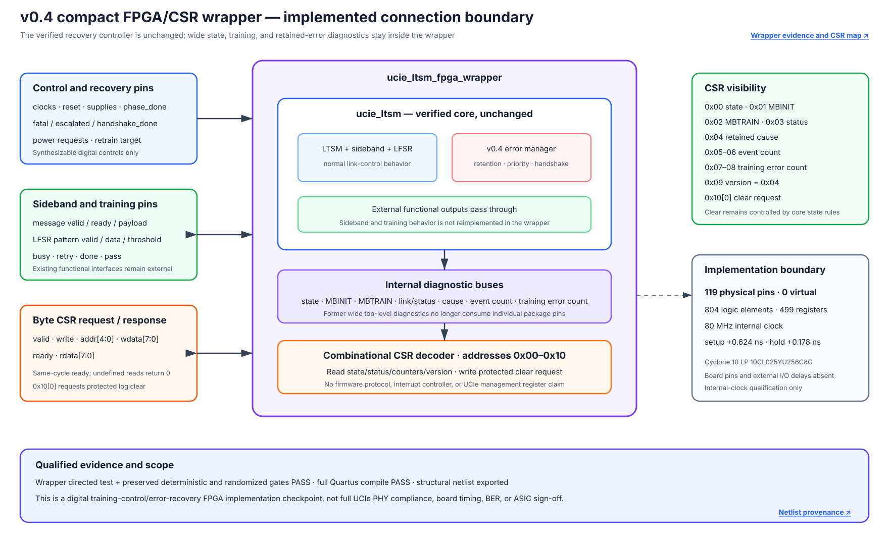

# Quartus Results

The current release implementation uses Quartus Prime Lite 23.1std.1 and targets Cyclone 10 LP device `10CL025YU256C8G`.

## v0.4 implementation boundary

The reusable `ucie_ltsm` top now exposes 149 signals and does not fit the selected package when every wide diagnostic is treated as a physical pin. This is an interface-width limitation, not a synthesis failure. The separate `ucie_ltsm_fpga_wrapper` keeps the core unchanged, internalizes those wide state/error/training diagnostics, and provides a compact byte CSR. It is the fitted and timed v0.4 release boundary.



## Reproduce

```powershell
Push-Location quartus
& 'C:\intelFPGA_lite\23.1std\quartus\bin64\quartus_sh.exe' --flow compile ucie_ltsm_fpga
Pop-Location
```

Project and constraint inputs:

- [`quartus/ucie_ltsm_fpga.qpf`](../../quartus/ucie_ltsm_fpga.qpf)
- [`quartus/ucie_ltsm_fpga.qsf`](../../quartus/ucie_ltsm_fpga.qsf)
- [`quartus/ucie_ltsm.sdc`](../../quartus/ucie_ltsm.sdc)
- [`rtl/ucie_ltsm_pkg.sv`](../../rtl/ucie_ltsm_pkg.sv)
- [`rtl/ucie_sb_sequencer.sv`](../../rtl/ucie_sb_sequencer.sv)
- [`rtl/ucie_lfsr_training_engine.sv`](../../rtl/ucie_lfsr_training_engine.sv)
- [`rtl/ucie_error_manager.sv`](../../rtl/ucie_error_manager.sv)
- [`rtl/ucie_ltsm.sv`](../../rtl/ucie_ltsm.sv)
- [`rtl/ucie_ltsm_fpga_wrapper.sv`](../../rtl/ucie_ltsm_fpga_wrapper.sv)

## Checked constraint

`clk_i` is constrained to 12.500 ns, or 80 MHz. The RTL default `CLK_HZ` is also 80 MHz, so its microsecond-to-tick conversion matches this project configuration. Testbenches override timing parameters for shorter simulations.

## v0.4 wrapper utilization

| Resource | Used | Device total |
|---|---:|---:|
| Logic elements | 804 | 24,624 |
| Combinational functions | 802 | 24,624 |
| Dedicated logic registers | 499 | 24,624 |
| Total registers | 499 | - |
| Physical pins | 119 | 151 |
| Virtual pins | 0 | - |
| Memory bits | 0 | 608,256 |
| 9-bit multipliers | 0 | 132 |
| PLLs | 0 | 4 |

## v0.4 wrapper timing

| Corner/check | Result |
|---|---:|
| Slow 1200 mV, 85 C setup slack | `+0.624 ns` |
| Slow 1200 mV, 85 C hold slack | `+0.436 ns` |
| Slow 1200 mV, 0 C setup slack | `+1.602 ns` |
| Slow 1200 mV, 0 C hold slack | `+0.385 ns` |
| Fast 1200 mV, 0 C setup slack | `+7.416 ns` |
| Fast 1200 mV, 0 C hold slack | `+0.178 ns` |
| Setup/hold TNS | `0.000 ns` |

Positive slack qualifies analyzed internal `clk_i` paths at 80 MHz. The result is not fully constrained: exact board pin locations and external input/output delays are absent. It is therefore not board-level signoff, an ASIC result, or a UCIe link-rate claim.

Quartus completed with zero errors. Documented warnings include constant upper sideband-message bits, unused `csr_wdata_i[7:1]`, missing pin/I/O-delay constraints, the Lite-edition LogicLock limitation, and an existing parameter-width truncation warning in `ucie_error_manager`. None prevented fitting or analyzed internal timing.

Selected source summaries are retained in [`quartus/output_files_wrapper`](../../quartus/output_files_wrapper/). Large databases, programming files, and raw reports remain ignored.

## Functional netlist evidence

The v0.4 evidence pack retains two Quartus functional Verilog views:

- fitted release boundary: [`ucie_ltsm_fpga_wrapper.vo`](../../synthesis/quartus/netlists/v0.4-error-recovery/ucie_ltsm_fpga_wrapper.vo), SHA-256 `102231FB12CEA16D83070312EFF10FC04A95E0C85D297AE48ABB5D1515D13B52`;
- core-only synthesis view: [`ucie_ltsm.vo`](../../synthesis/quartus/netlists/v0.4-error-recovery/ucie_ltsm.vo), SHA-256 `34756D33181875CB10D05FEBB60E079814EEB98301CB9FA01BE0F5F08BDEF969`.

The [netlist manifest](../../synthesis/quartus/netlists/v0.4-error-recovery/README.md) distinguishes their provenance and claims. Regenerate the fitted wrapper view from the repository root:

```powershell
.\scripts\export_quartus_netlist.ps1 `
  -Version v0.4-error-recovery `
  -Project ucie_ltsm_fpga `
  -OutputName ucie_ltsm_fpga_wrapper.vo
```

The exporter runs a full compile and the 23.1 EDA Netlist Writer in functional Verilog mode. The `.vo` files contain Intel device primitives and require matching Intel simulation libraries. They are not editable RTL, post-route timing netlists, ASIC standard-cell netlists, programming images, or board signoff evidence.

## Historical comparison

The stable v0.3 core top fitted with 698 logic elements, 465 registers, 126 pins, worst setup slack `+0.744 ns`, worst hold slack `+0.178 ns`, and zero setup/hold TNS at the same 80 MHz constraint. v0.4 adds the error manager and wrapper decoder while reducing the selected physical top's pin use to 119 by moving wide diagnostics behind the CSR.
