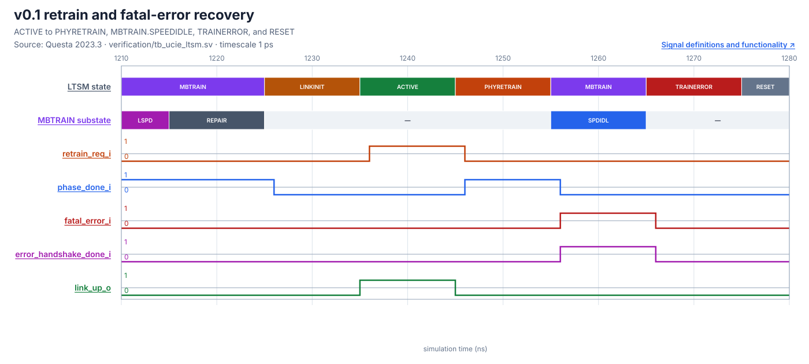
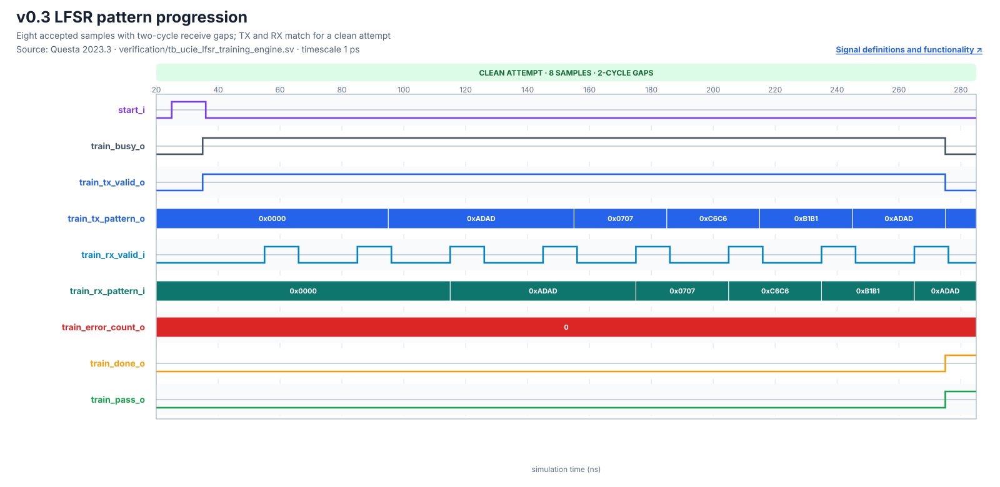
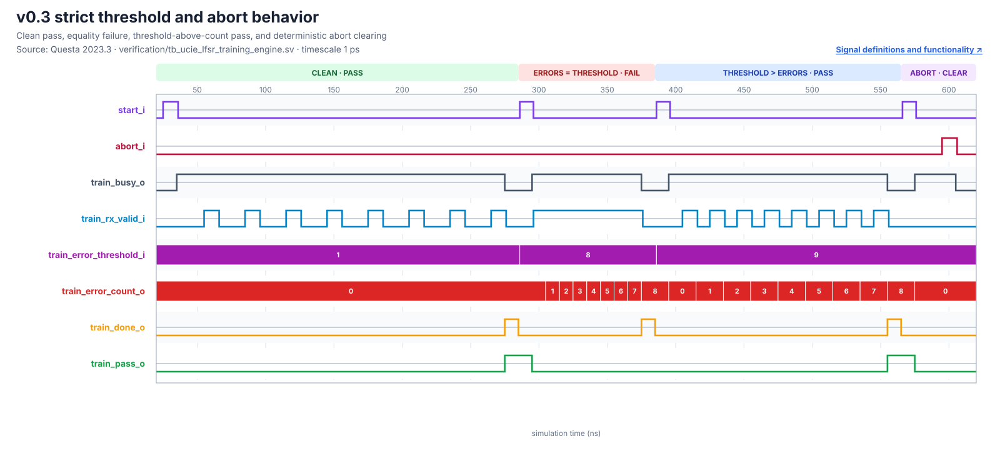
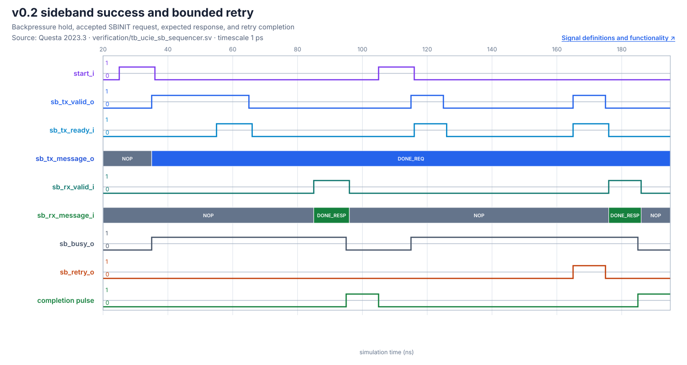
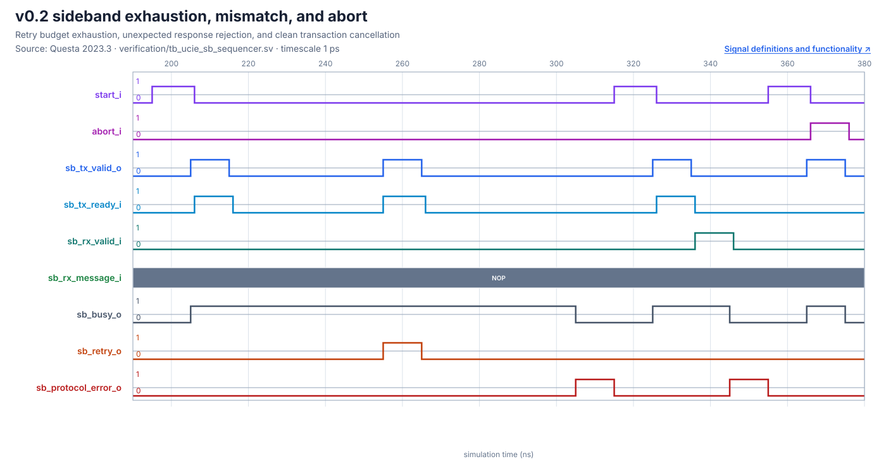

# Questa Results

Deterministic and randomized regressions were freshly rerun through **August 30, 2026** using Questa Intel Starter FPGA Edition 2023.3.

## Directed test

Command:

```powershell
& 'C:\intelFPGA_lite\questa_fse\win64\vsim.exe' -c -do scripts/run_questa.do
```

Observed result:

- SystemVerilog compilation: 0 errors, 0 warnings.
- Simulation: `PASS: nominal training, retrain, and error recovery`.
- Simulator summary: 0 errors; one `-assertdebug` accessibility warning.
- No assertion failure was reported.

## Directed waveform evidence

The release figures are generated from a VCD captured during the same self-checking directed scenario:

```powershell
& 'C:\intelFPGA_lite\questa_fse\win64\vsim.exe' -c -do scripts/capture_directed_waveform.do
python scripts/render_waveforms.py
```


The nominal figure shows RESET residency followed by SBINIT, all six MBINIT substates, all thirteen MBTRAIN substates, LINKINIT, and ACTIVE. Because the directed test deasserts and reasserts `phase_done_i` in the same simulation timestamp between back-to-back operations, the VCD renders it as one continuous high interval across each ordered substate run; the enum buses retain every registered substate boundary.



The second figure retains the final MBTRAIN context, then shows LINKINIT/ACTIVE, an ACTIVE-to-PHYRETRAIN request, `MBTRAIN.SPEEDIDLE` re-entry, fatal-error handshake, TRAINERROR, and RESET. Short substate labels are expanded in the [asset README](../../assets/README.md).

### Signal and functionality pointers

Signal names inside the SVG figures are clickable. This table provides the same links when a Markdown renderer displays SVGs as non-interactive images.

| Waveform label | Function in v0.1 | Detailed explanation |
|---|---|---|
| `LTSM state` | Registered top-level controller state | [`state_o`](../02_ltssm/signals.md#wave-state-output) |
| `MBINIT substate` | Ordered mainband-initialization step, shown only during MBINIT | [`mbinit_state_o`](../02_ltssm/signals.md#wave-mbinit-output) |
| `MBTRAIN substate` | Ordered mainband-training step, shown only during MBTRAIN | [`mbtrain_state_o`](../02_ltssm/signals.md#wave-mbtrain-output) |
| `phase_done_i` | Abstract completion of the active modeled operation | [Completion behavior](../02_ltssm/signals.md#wave-phase-done) |
| `rdi_active_i` | LINKINIT-to-ACTIVE confirmation | [RDI active confirmation](../02_ltssm/signals.md#wave-rdi-active) |
| `link_up_o` | High only while the controller is ACTIVE | [Link-up status](../02_ltssm/signals.md#wave-link-up) |
| `retrain_req_i` | Requests ACTIVE-to-PHYRETRAIN entry | [Retrain request](../02_ltssm/signals.md#wave-retrain-request) |
| `fatal_error_i` | Requests the global fatal-error path | [Fatal error](../02_ltssm/signals.md#wave-fatal-error) |
| `error_handshake_done_i` | Qualifies entry into TRAINERROR outside SBINIT | [Error handshake](../02_ltssm/signals.md#wave-error-handshake) |

The intermediate VCD under `build/waves/` is ignored. The capture script, standard-library renderer, and reviewed SVG outputs are versioned so the figures remain reproducible without committing a bulky waveform database.

## v0.3 DATATRAINCENTER1 regression

Commands:

```powershell
& 'C:\intelFPGA_lite\questa_fse\win64\vsim.exe' -c -do scripts/run_lfsr_directed.do
.\scripts\run_datatrain_random_regression.ps1
```

The focused directed test passed at 41576 ns and proved lane seeds, all sixteen output bits, every 23-bit polynomial step, receive gaps, strict equality failure, threshold-above-count pass, abort clearing, default 4096-sample completion, and `16'hffff` saturation.

Five reproducible seeds (`701`, `802`, `903`, `1004`, and `1105`) ran 32 reset-isolated training trials each. Aggregate outcomes were 47 direct passes, 32 fail/retry scenarios, 44 aborts, and 37 LTSM timeouts. The independent model checked 368 clean samples, 654 corrupted samples, and 1,768 receive-gap cycles with exact DUT/reference agreement. All required explicit outcome/error/gap/threshold bins and all twelve scenario-by-gap crosses were hit. Every run ended with zero UVM errors/fatals, zero illegal transitions, and zero assertion failures.

The installed Starter license cannot run class `randomize()` or native covergroups. The campaign uses seeded `$urandom_range` over explicit legal domains and explicit sampled coverage reports; no UCDB percentage is claimed. See the [full DATATRAINCENTER1 results](datatrain_lfsr.md).

### v0.3 waveform evidence

```powershell
& 'C:\intelFPGA_lite\questa_fse\win64\vsim.exe' -c -do scripts/capture_datatrain_waveform.do
python scripts/render_datatrain_waveforms.py
```





Signal labels inside the SVGs link to the [v0.3 signal/function guide](../02_ltssm/signals.md#v03-training-signal-guide). The first figure isolates a clean eight-sample attempt with receive gaps; the second separates clean pass, equality failure, threshold-above-count pass, and abort clearing.

## UVM regression

Command:

```powershell
.\scripts\run_uvm_regression.ps1
```

| Test | Top-level transitions | Illegal transitions | Observed flags | UVM errors / fatals |
|---|---:|---:|---|---|
| `nominal_test` | 5 | 0 | active=1 | 0 / 0 |
| `timeout_test` | 3 | 0 | trainerror=1 | 0 / 0 |
| `recovery_test` | 9 | 0 | active=1, retrain=1, trainerror=1 | 0 / 0 |
| `pm_test` | 7 | 0 | active=1, pm=1 | 0 / 0 |
| `sb_success_test` | 2 | 0 | accepted requests=1, successful SBINIT exits=1 | 0 / 0 |
| `sb_retry_test` | 2 | 0 | accepted requests=2, retries=1, successful SBINIT exits=1 | 0 / 0 |
| `sb_error_test` | 3 | 0 | accepted requests=1, protocol errors=1, trainerror=1 | 0 / 0 |
| `sb_exhaust_test` | 3 | 0 | accepted requests=2, retries=1, protocol errors=1, trainerror=1 | 0 / 0 |

The regression script completed with `PASS: all 8 UVM tests`. Each test ran in a fresh simulator invocation.

## Seeded randomized regression

Command:

```powershell
.\scripts\run_random_regression.ps1
```

Five reproducible seeds (`101`, `202`, `303`, `404`, and `505`) ran 40 transactions each.
Aggregate scenario hits were:

| Outcome | Hits |
|---|---:|
| Immediate success | 47 |
| Retry followed by success | 46 |
| Wrong response | 63 |
| Retry exhaustion | 44 |

Across all 200 trials, the passive monitor observed 290 accepted requests, 93 successful SBINIT
exits, 90 retries, and 107 protocol errors. These totals exactly matched the per-seed UVM predictor.
Every seed exercised all four outcomes, all scoreboards reported zero illegal transitions, and every
run ended with zero UVM errors and zero UVM fatals.

The campaign randomizes within explicit legal domains using seeded `$urandom_range`; Questa Starter
does not provide the license needed for class `randomize()`. Raw logs remain ignored and are not
committed.


## Sideband sequencer directed test

Command:

```powershell
& 'C:\intelFPGA_lite\questa_fse\win64\vsim.exe' -c -do scripts/run_sb_directed.do
```

Observed result: `PASS: sideband backpressure, success, retry, exhaustion, mismatch, and abort`.
The test also runs assertions that the request remains stable under transmit backpressure,
a retry reissues transmit-valid, and completion follows the expected response.

### Sideband waveform evidence

The reviewed v0.2 figures are generated from the same standalone directed test:

```powershell
& 'C:\intelFPGA_lite\questa_fse\win64\vsim.exe' -c -do scripts/capture_sideband_waveform.do
python scripts/render_sideband_waveforms.py
```



The first figure proves that transmit valid and the request remain presented while ready is low, then separates request acceptance from the expected response. Its second transaction shows one response timeout, one retry pulse, a retransmitted request, and successful completion.



The second figure shows the terminal paths: retry-budget exhaustion, rejection of an unexpected `NOP` response, and abort cancellation of an outstanding request without a completion or protocol-error pulse.

<a id="v02-sideband-signal-pointers"></a>
### v0.2 sideband signal pointers

Signal labels inside the SVGs are clickable. These normal Markdown links provide the same explanation when SVG interaction is disabled.

| Waveform label | Function | Detailed explanation |
|---|---|---|
| `start_i` | Launches one sequencer transaction | [Sequencer start](../02_ltssm/signals.md#wave-sb-start) |
| `abort_i` | Cancels an outstanding transaction | [Sequencer abort](../02_ltssm/signals.md#wave-sb-abort) |
| `sb_tx_valid_o` | Presents a stable outbound request | [Transmit valid](../02_ltssm/signals.md#wave-sb-tx-valid) |
| `sb_tx_ready_i` | Accepts the outbound request | [Transmit ready](../02_ltssm/signals.md#wave-sb-tx-ready) |
| `sb_tx_message_o` | Carries `SBINIT_DONE_REQ` | [Transmit message](../02_ltssm/signals.md#wave-sb-tx-message) |
| `sb_rx_valid_i` | Marks a received response as valid | [Receive valid](../02_ltssm/signals.md#wave-sb-rx-valid) |
| `sb_rx_message_i` | Carries the expected or malformed response | [Receive message](../02_ltssm/signals.md#wave-sb-rx-message) |
| `sb_busy_o` | Covers SEND and WAIT residence | [Busy status](../02_ltssm/signals.md#wave-sb-busy) |
| `sb_retry_o` | Marks a bounded retransmission | [Retry indication](../02_ltssm/signals.md#wave-sb-retry) |
| `completion pulse` | Reports the expected response | [Internal completion](../02_ltssm/signals.md#wave-sb-done) |
| `sb_protocol_error_o` | Reports wrong response or exhausted retries | [Protocol error](../02_ltssm/signals.md#wave-sb-protocol-error) |

## Interpretation

These runs support the named controller scenarios. Feature-event counters provide scenario evidence,
but are not a merged UCDB functional-coverage closure report. The runs do not provide electrical
compliance, random-stimulus closure, or proof of all UCIe 2.0 requirements.
