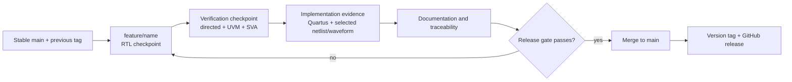

# Incremental Design, Verification, and Release Workflow

This project uses three Codex tasks with different responsibilities. All three currently point at the same workspace, so they must not edit or run destructive/generated-file cleanup concurrently.

## Task roles

| Task | Responsibility | Must not do |
|---|---|---|
| Design task | Implement one bounded RTL advancement on a feature branch; explain interfaces and expected behavior | Declare verification complete, tag a release, or publish to GitHub |
| Verification task | Review the RTL delta; add/update directed tests, UVM, SVA, and coverage; run reproducible flows; produce selected evidence | Rewrite unrelated RTL, tag a release, or publish unverified work |
| Repository/release task | Audit the delta and evidence; update documentation; merge stable work; tag and publish in order | Merge or tag when required evidence is missing |

## Milestone sequence



Only one task owns the workspace during each checkpoint. The owning task must stop and hand off before the next task starts.

## 1. Design checkpoint

1. Begin from a clean `main` at the latest stable tag.
2. Create or switch to `feature/<feature-name>`.
3. Implement one coherent advancement without renaming established interfaces unnecessarily.
4. Run at least compile/lint and the existing directed smoke test when the interface permits it.
5. Commit the RTL checkpoint.
6. Hand off the branch name, commit SHA, changed files, new/changed signals, expected state behavior, and known limitations.

The design task does not call a feature stable merely because it compiles.

## 2. Verification checkpoint

The verification task starts only after the design task has stopped.

1. Inspect the delta from the previous stable tag.
2. Map every real behavior change to directed stimulus, UVM sequences/tests, assertions, and functional coverage where applicable.
3. Preserve prior regression behavior.
4. Run each required test in a fresh simulator invocation.
5. Record pass/fail conditions and remaining gaps.
6. Commit the verification checkpoint on the feature branch.

Minimum regression gate:

- existing directed test passes;
- all existing UVM tests pass with zero UVM errors/fatals;
- feature-specific directed/UVM tests pass;
- no assertion failure is present; and
- coverage claims are backed by a report, not inferred from stimulus.

## 3. Netlist and waveform evidence

Evidence must be useful on GitHub without turning the repository into a simulator database archive.

### Waveforms

- Publish selected, cropped PNG or SVG figures under `assets/waveforms/<version-or-feature>/`.
- Each figure needs a caption, signal list, scenario, expected event, and explanation of what it proves.
- Keep raw WLF, VCD, SHM, and UCDB files ignored unless a future milestone provides a specific reproducibility reason.

### Netlists

- Generate the netlist from a documented script/tool command.
- Publish a versioned, reviewable netlist only after checking size, licensing/tool restrictions, generated comments, paths, and reproducibility.
- Store accepted netlists under `synthesis/quartus/netlists/<version-or-feature>/` or the corresponding Cadence directory.
- Do not publish device programming files, Quartus databases, Cadence work libraries, or private library data.

### Implementation reports

- Keep compact summaries and selected meaningful reports.
- Record tool version, device/library, constraints, clock definition, warnings, and whether timing is fully constrained.
- Never present FPGA timing as ASIC timing or a PHY link-rate result.

## 4. Documentation and release checkpoint

The repository task compares the feature branch against the previous stable tag and updates only affected material:

- root `README.md` version/status table;
- architecture, algorithm, RTL, and verification pages;
- requirements traceability and test plan;
- results and selected evidence captions;
- `CHANGELOG.md`, `ROADMAP.md`, and `DOCUMENTATION_STATUS.md`; and
- `docs/versions/vX.Y_<feature>.md`.

The release gate requires:

- a clean publishable Git status;
- no private specification material;
- all required tests passing;
- synthesis/implementation evidence accurately qualified;
- selected netlist/waveform artifacts reviewed;
- relative links resolving; and
- limitations and missing evidence stated explicitly.

If the gate passes, merge into `main`, create the ordered version tag, publish the branch/tag, and prepare GitHub Release notes. Otherwise keep the work on its feature branch and mark it in progress.

## Handoff record

Every task-to-task handoff should include:

```text
Milestone / feature:
Branch:
Commit SHA:
Previous stable tag:
Files changed:
Behavior added or changed:
Interface changes:
Tests added or changed:
Commands run:
Observed results:
Netlist/waveform evidence:
Known limitations:
Next task requested:
```

## Planned release order

| Tag | Intended addition | Current status |
|---|---|---|
| `v0.1-basic-ltssm` | Basic hierarchical LTSM | Stable local tag |
| `v0.2-sideband` | Bounded SBINIT sideband sequencing/integration | Stable after design, verification, evidence, and publication review |
| `v0.3-advanced-training` | Concrete training operations | Planned |
| `v0.4-recovery` | Expanded recovery/error behavior | Planned |
| `v1.0-integrated-ltssm` | Integrated verified controller | Future |

The exact content of a later version is determined from implemented code and evidence, not from the tag name alone.
