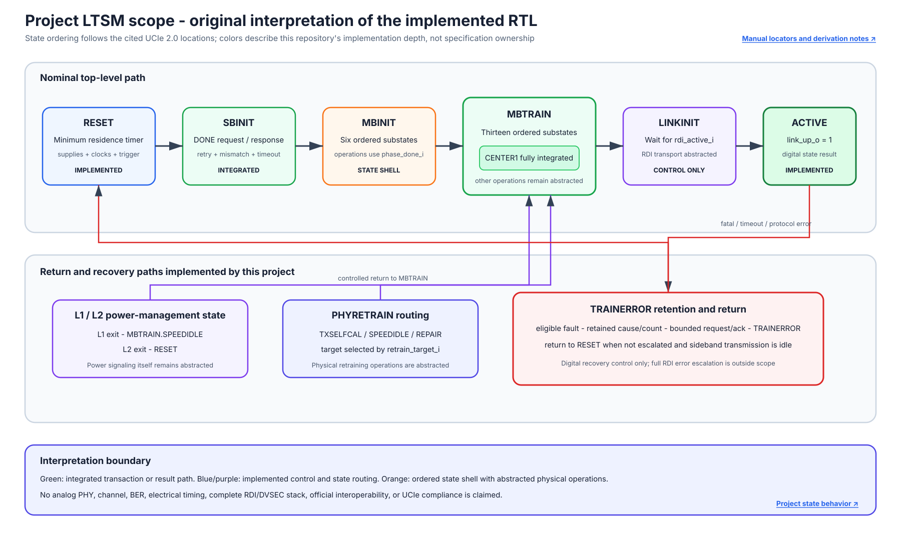
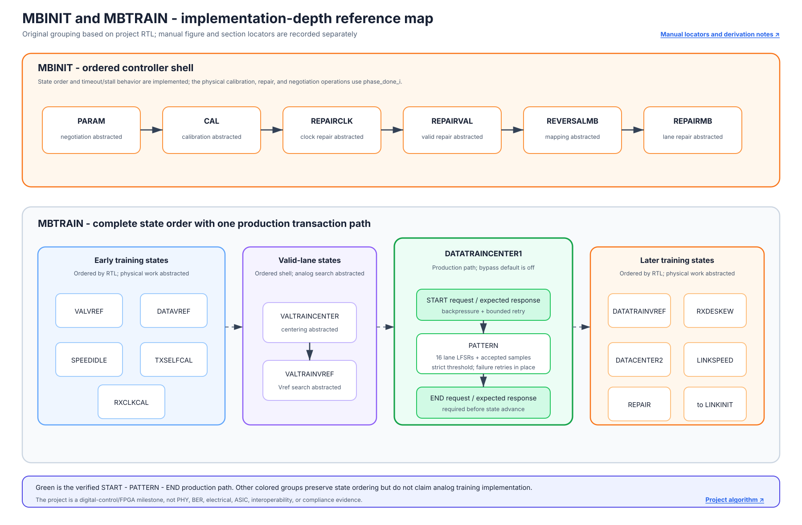
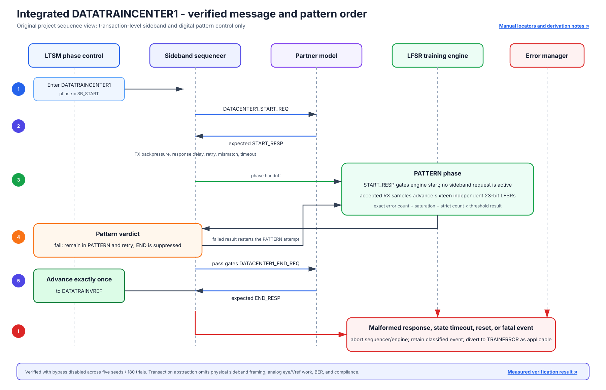
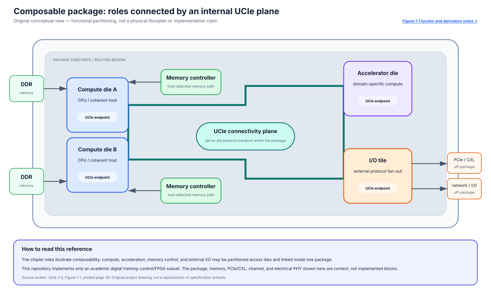
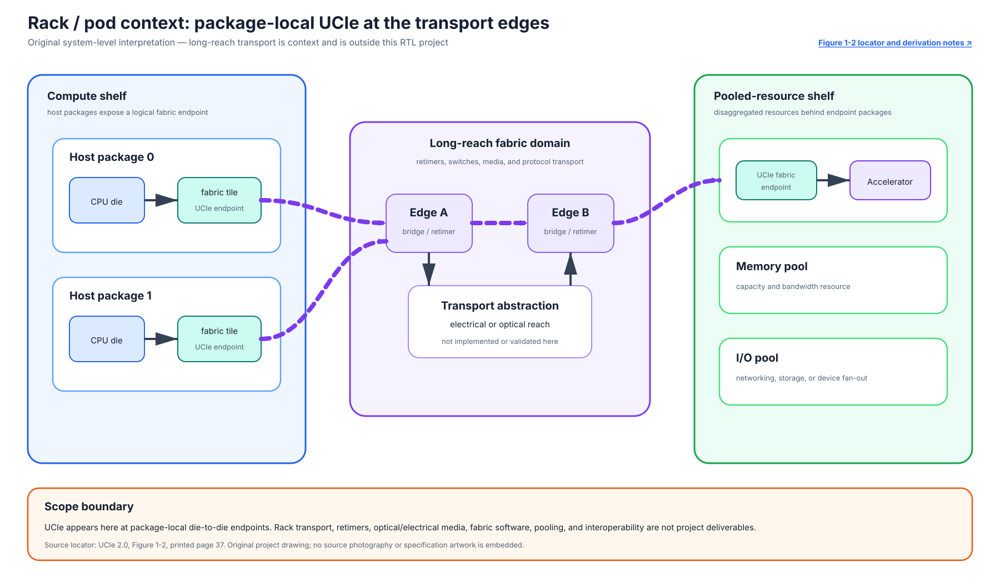
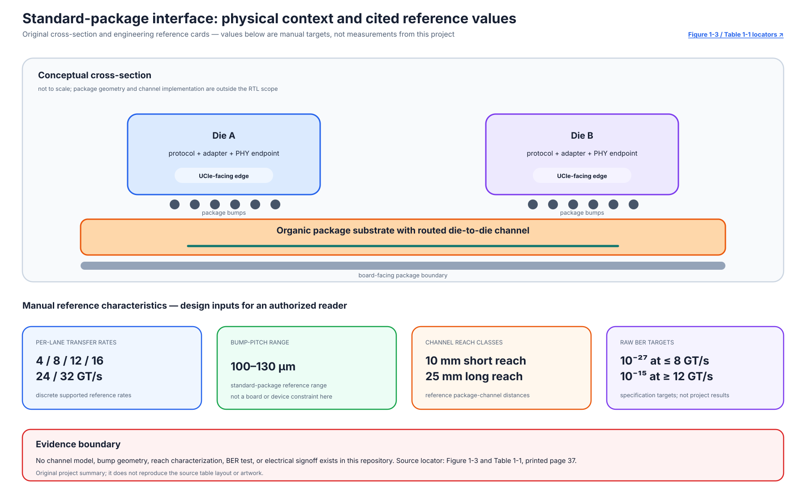
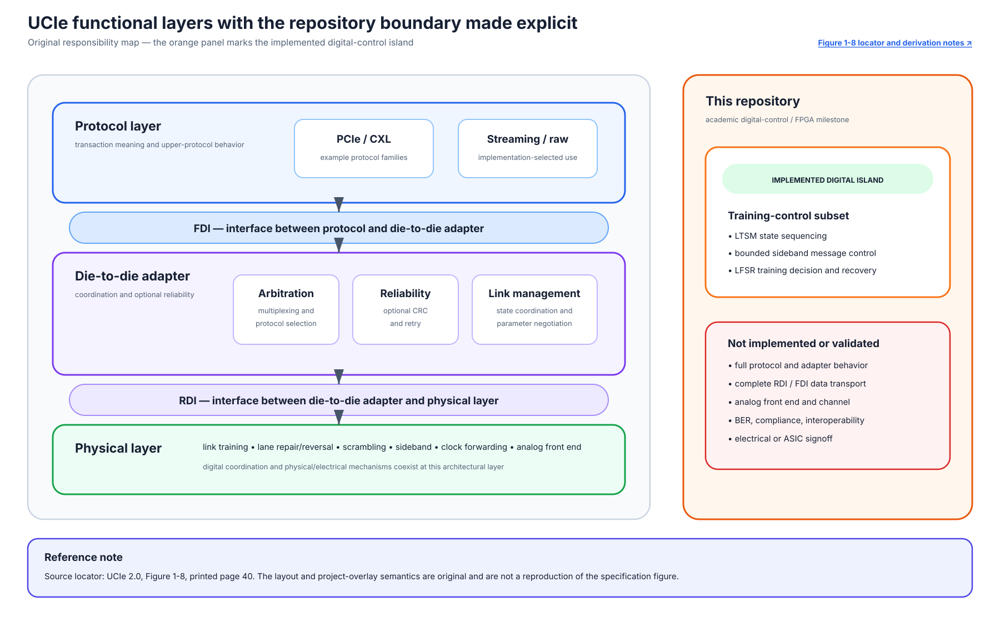
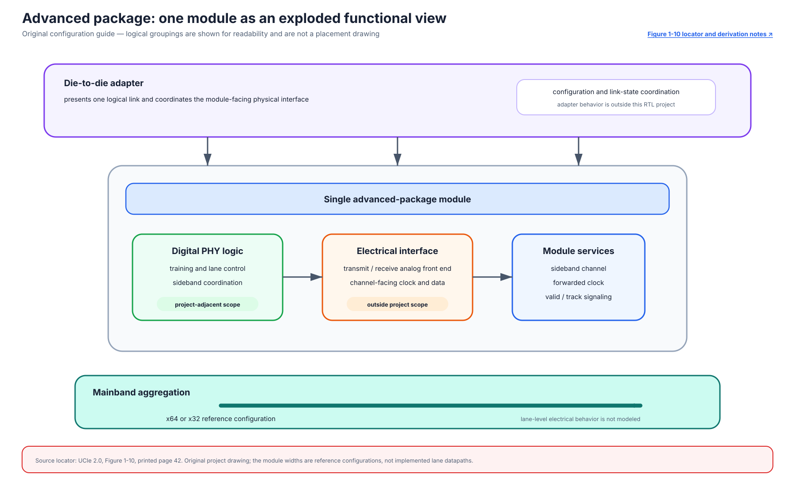
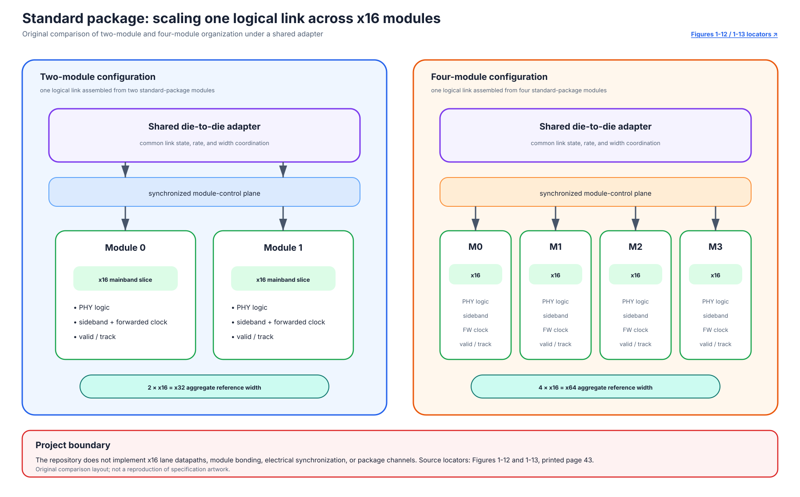

# Specification Figure and Section Reference Index

This index connects the repository's original diagrams to the manual locations used as design references. It does not reproduce specification artwork, tables, page images, or wording. The private local PDF remains under `references_private/` and is intentionally excluded from Git.

Reference edition: *UCIe Specification Revision 2.0, Version 1.0*, August 6, 2024. Obtain an authorized copy from the [UCIe Consortium specification page](https://www.uciexpress.org/specifications).

Specification copyright: © 2022–2024 Universal Chiplet Interconnect Express, Inc. All rights reserved.

The page numbers below are the numbered PDF pages printed in that edition. For a local authorized copy, open:

```text
references_private/UCIe_Specification_rev2p0_ver1p0_final_2024Aug06_public_clean (website requests).pdf
```

## Diagram 1: project LTSM scope

[](../assets/diagrams/specification-reference/project-ltsm-scope.svg)

| Reference locator | Page | How it informed the original diagram |
|---|---:|---|
| Section 4.5.3, Link Training State Machine | 129-170 | Names and high-level purposes of the top-level states |
| Table 4-6, State Definitions for Initialization | 129 | State vocabulary and initialization roles |
| Figure 4-33, Link Training State Machine | 130 | Nominal ordering and the existence of retrain, power-management, and error return paths |
| Sections 4.5.3.1-4.5.3.9 | 131-170 | Per-state behavior used to annotate the project's implemented and abstracted boundaries |

This is not a redraw of Figure 4-33. It uses a horizontal implementation-depth layout, repository-specific color semantics, RTL signal names, and the verified retained-error behavior. The exact project behavior is documented in the [LTSM guide](02_ltssm/README.md) and [requirements traceability matrix](requirements_traceability.md).

## Diagram 2: training scope map

[](../assets/diagrams/specification-reference/training-scope-map.svg)

| Reference locator | Page | How it informed the original diagram |
|---|---:|---|
| Section 4.5.3.3, MBINIT | 135-154 | Ordered MBINIT state vocabulary |
| Figure 4-34, MBINIT: Mainband Initialization and Repair Flow | 136 | Six-state MBINIT order |
| Section 4.5.3.4, MBTRAIN | 154-166 | Ordered MBTRAIN state vocabulary |
| Figure 4-41, Mainband Training | 155 | Relationship between early training, centering, later training, retrain, and link initialization |
| Section 4.5.3.4.8, MBTRAIN.DATATRAINCENTER1 | 159-160 | Location of the integrated digital training operation within MBTRAIN |

The project diagram deliberately groups states by implementation depth rather than copying the specification topology. In the current RTL, state ordering is implemented for all shown substates; only DATATRAINCENTER1 has the integrated production transaction and pattern path. Other physical operations still use the documented `phase_done_i` abstraction.

## Diagram 3: integrated DATATRAINCENTER1 order

[](../assets/diagrams/specification-reference/integrated-datatrain-order.svg)

| Reference locator | Page | How it informed the original diagram |
|---|---:|---|
| Section 4.4.1, LFSR pattern | 119 | Continuous-mode LFSR pattern source referenced by training |
| Section 4.5.3.4.8, MBTRAIN.DATATRAINCENTER1 | 159-160 | START, digital pattern work, result decision, and END ordering |
| Table 7-9, LTSM-related message encodings | 264 | DATATRAINCENTER1 START/END request and response message identities |
| Section 4.5.3.8, TRAINERROR | 169-170 | Error-state transition and sideband-handshake context |

The diagram is based primarily on the checked RTL in `rtl/ucie_ltsm.sv`, `rtl/ucie_sb_sequencer.sv`, `rtl/ucie_lfsr_training_engine.sv`, and `rtl/ucie_error_manager.sv`. It therefore shows project-specific retry, gating, retained-event, and abort behavior instead of presenting itself as a normative protocol figure. See the [v1.0 verification result](06_results/v1.0_integrated_training.md) for the independent message-order predictor and production-mode campaign.

## Diagram 4: package and chiplet composition

[](../assets/diagrams/specification-reference/package-chiplet-composition.svg)

| Reference locator | Page | How it informed the original diagram |
|---|---:|---|
| Chapter 1, Figure 1-1, *A Package Composed of CPU Dies, Accelerator Die(s), and I/O Tile Die Connected through UCIe* | 36 | Functional roles that may be separated across compute, accelerator, and I/O dies, with package-local UCIe connectivity |

The new drawing uses a hub-and-role information layout rather than the source figure's arrangement. Memory and off-package protocol blocks are shown only as system context. None of those blocks, the package routing, or the electrical UCIe endpoints are implemented by this repository.

## Diagram 5: rack and pod long-reach context

[](../assets/diagrams/specification-reference/rack-pod-long-reach.svg)

| Reference locator | Page | How it informed the original diagram |
|---|---:|---|
| Chapter 1, Figure 1-2, *UCIe enabling long-reach connectivity at Rack/Pod Level* | 37 | System context in which package-local die-to-die endpoints can sit at the edges of longer-reach fabric transport |

This original three-domain view separates compute packages, conceptual long-reach transport, and pooled resources. It does not reproduce source photography. Retimers, switches, electrical or optical media, pooling software, and rack-level interoperability are outside the project scope.

## Diagram 6: standard-package interface and reference characteristics

[](../assets/diagrams/specification-reference/standard-package-reference.svg)

| Reference locator | Page | How it informed the original diagram |
|---|---:|---|
| Chapter 1, Figure 1-3, *Standard Package interface* | 37 | Conceptual relationship among dies, package bumps, substrate, and routed die-to-die channel |
| Chapter 1, Table 1-1, *Characteristics of UCIe on Standard Package* | 37 | Reference rates, bump-pitch range, channel-reach classes, and raw-BER targets summarized as independent cards |

The cards summarize selected navigation facts rather than reproduce the source table or its styling. The cited per-lane rates are 4, 8, 12, 16, 24, and 32 GT/s; the bump-pitch range is 100–130 µm; the short- and long-reach classes are 10 mm and 25 mm; and the cited raw-BER targets are 10⁻²⁷ at up to 8 GT/s and 10⁻¹⁵ at 12 GT/s and above. These are specification reference values, not measured project results. The repository contains no channel model, bump implementation, reach characterization, BER experiment, or electrical signoff.

## Diagram 7: UCIe layers and project boundary

[](../assets/diagrams/specification-reference/ucie-layer-boundaries.svg)

| Reference locator | Page | How it informed the original diagram |
|---|---:|---|
| Chapter 1, Figure 1-8, *UCIe Layers and functionalities* | 40 | Protocol, die-to-die adapter, and physical-layer responsibilities separated by the FDI and RDI interfaces |

The original responsibility map adds a project-specific boundary panel. It highlights only the implemented digital training-control island and explicitly excludes full protocol/adapter behavior, complete FDI/RDI transport, analog PHY and channel behavior, BER, interoperability, and compliance.

## Diagram 8: advanced-package single module

[](../assets/diagrams/specification-reference/advanced-single-module.svg)

| Reference locator | Page | How it informed the original diagram |
|---|---:|---|
| Chapter 1, Figure 1-10, *Single module configuration: Advanced Package* | 42 | One logical module beneath an adapter, with PHY logic, sideband, forwarded clock, mainband aggregation, and valid/track signaling |

The project drawing uses an exploded-card layout and retains only the architecture-level relationships. The x64/x32 widths are cited reference configurations; the repository does not implement those lane datapaths or their package/electrical behavior.

## Diagram 9: standard-package multi-module configurations

[](../assets/diagrams/specification-reference/standard-multimodule-comparison.svg)

| Reference locator | Page | How it informed the original diagram |
|---|---:|---|
| Chapter 1, Figure 1-12, *Two-module configuration for Standard Package* | 43 | Two x16 modules coordinated as one x32 reference configuration beneath a shared adapter |
| Chapter 1, Figure 1-13, *Four-module configuration for Standard Package* | 43 | Four x16 modules coordinated as one x64 reference configuration beneath a shared adapter |

The new side-by-side comparison uses compact module cards and a common coordination plane. It is not a lane-level implementation diagram. Module bonding, physical synchronization, full-width datapaths, forwarded-clock behavior, and electrical channels remain outside the project.

## Citation and redistribution boundary

- These SVGs are original repository-native vector drawings. They contain no embedded raster images or copied specification artwork.
- Figure numbers, section numbers, titles, and page locators are used only to help an authorized reader navigate the cited edition.
- The repository does not redistribute the specification PDF, extracted text, screenshots, figures, or tables.
- The diagrams describe a final academic digital-control/FPGA implementation scope. They do not establish analog PHY validation, BER, electrical signoff, ASIC PPA, official interoperability, or UCIe compliance.
