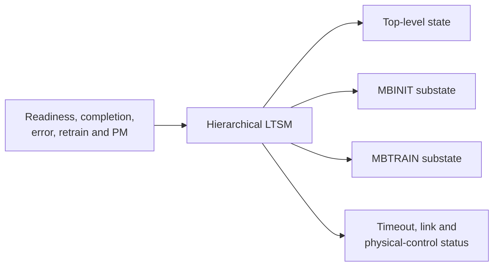
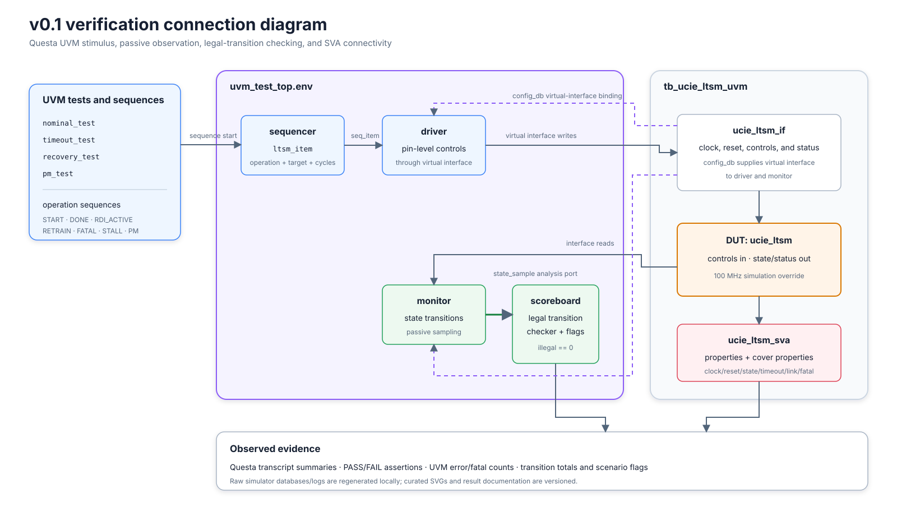

# Version 0.1 - Basic LTSM

## 1. Version objective

Establish a synthesizable, hierarchical UCIe 2.0 LTSM controller whose control flow can be reproduced in directed simulation, UVM, and an FPGA implementation flow.

## 2. Starting point

This is the initial public milestone. There is no earlier tagged implementation.

## 3. New concept

A link-training state machine orders the work required to move a die-to-die connection from reset toward active operation. This milestone represents that order without implementing the physical training engines themselves.

## 4. Why it is needed

Initialization contains dependencies: sideband readiness precedes mainband work, mainband initialization precedes training, and link initialization precedes active traffic. Timeout, error, retrain, and power-management paths must not bypass that ordering.

## 5. Architecture

## 6. LTSM behavior

Implemented:

- nine top-level states;
- six MBINIT and thirteen MBTRAIN labels in a fixed order;
- RESET readiness gating;
- eligible-state timeout;
- retrain targets for `TXSELFCAL`, `SPEEDIDLE`, and `REPAIR`;
- TRAINERROR recovery; and
- L1/L2 entry with separate exit behavior.

Exact transitions are listed in [states.md](../02_ltssm/states.md).

## 7. Algorithm

The controller holds current state by default, gives accepted fatal error and timeout higher priority than normal progress, and otherwise applies the current state's transition rule. A single counter restarts when a state/substate changes or a stall occurs.

## 8. Pseudocode

Beginner-readable pseudocode and its flowchart are in the [algorithm guide](../03_algorithm/README.md).

## 9. RTL

Added:

- [`rtl/ucie_ltsm_pkg.sv`](../../rtl/ucie_ltsm_pkg.sv) for enumerated types.
- [`rtl/ucie_ltsm.sv`](../../rtl/ucie_ltsm.sv) for the controller.

The default clock parameter is 80 MHz to match the checked Quartus constraint. Simulation tops explicitly override it to match their 100 MHz clock.

## 10. Directed verification

[`verification/tb_ucie_ltsm.sv`](../../verification/tb_ucie_ltsm.sv) checks nominal initialization, SPEEDIDLE retraining, fatal-error entry, and return to RESET. Its fresh run passes.

## 11. UVM verification

The UVM environment adds an operation-level driver, passive transition monitor, legal-transition scoreboard, and four tests: nominal, timeout, recovery, and power management. All four pass in the fresh regression.

## 12. Results

- Directed Questa simulation: pass.
- Four-test UVM regression: pass with zero UVM errors/fatals.
- Quartus fit: successful on Cyclone 10 LP.
- Checked implementation: 152 logic elements and 48 registers.
- Slow-85 C setup slack: +1.441 ns on constrained internal clock paths at 80 MHz.

See [results](../06_results/README.md) for configuration and interpretation.

### Release evidence package

The tag retains reviewed, reproducible artifacts in addition to source and text summaries:

| Evidence | Artifact |
|---|---|
| RTL connections | [SVG diagram](../../assets/diagrams/v0.1-basic-ltssm/rtl-connections.svg) |
| Verification/UVM connections | [SVG diagram](../../assets/diagrams/v0.1-basic-ltssm/verification-connections.svg) |
| Nominal directed waveform | [SVG waveform](../../assets/waveforms/v0.1-basic-ltssm/nominal-training.svg) |
| Retrain/error directed waveform | [SVG waveform](../../assets/waveforms/v0.1-basic-ltssm/retrain-error-recovery.svg) |
| Quartus functional netlist | [Generated Verilog](../../synthesis/quartus/netlists/v0.1-basic-ltssm/ucie_ltsm.vo) |

The two waveform figures are rendered from a real Questa VCD generated by the directed test. The netlist is generated from the same v0.1 RTL and checked Quartus project. Limitations stated elsewhere on this page remain unchanged.

## 13. What changed from the previous version?

| Area | Previous | v0.1 |
|---|---|---|
| Public milestone | None | Initial tagged controller |
| RTL | No versioned baseline | Package + hierarchical LTSM |
| Directed verification | No versioned baseline | Self-checking scenario |
| UVM | No versioned baseline | Four scenario tests and scoreboard |
| FPGA evidence | No versioned baseline | Successful Quartus fit/timing |

## 14. Preserved functionality

Not applicable; this is the first milestone.

## 15. Current limitations

- `phase_done_i` abstracts sideband transactions, calibration, repair, and pattern operations.
- No sideband engine, RDI controller, CSR/DVSEC block, analog PHY, or compliance environment exists.
- L2 exit, two retrain targets, stall timing, and exhaustive timeout locations lack dedicated UVM tests.
- There are no functional covergroups or Cadence results.
- External I/O timing and exact FPGA pin assignments are incomplete, so the Quartus result is not board-level signoff.

## 16. Next planned stage

At the v0.1 snapshot, Version 0.2 was planned as a sideband sequencing layer. That advancement is now documented separately in [Version 0.2 - Sideband Integration](v0.2_sideband.md); the v0.1 tag itself remains unchanged.
