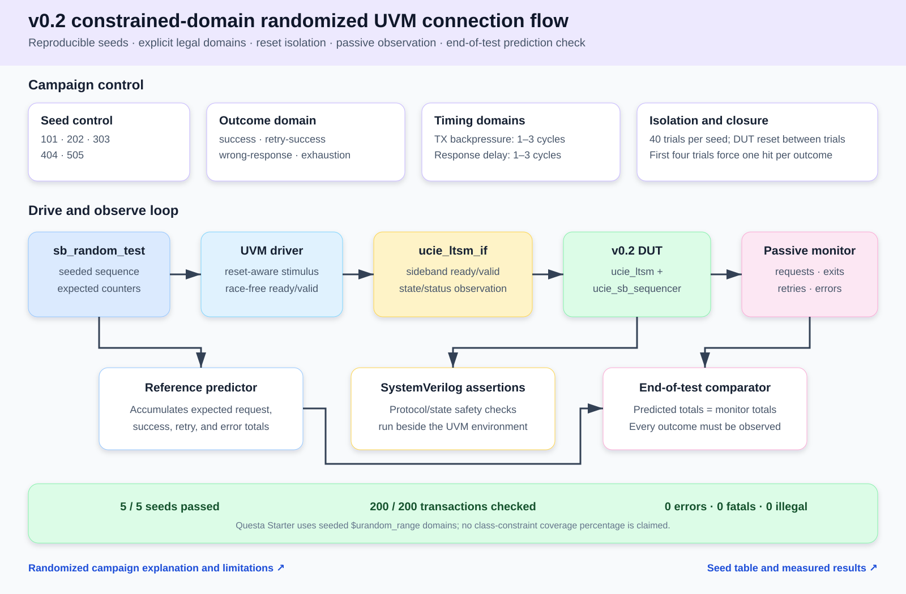
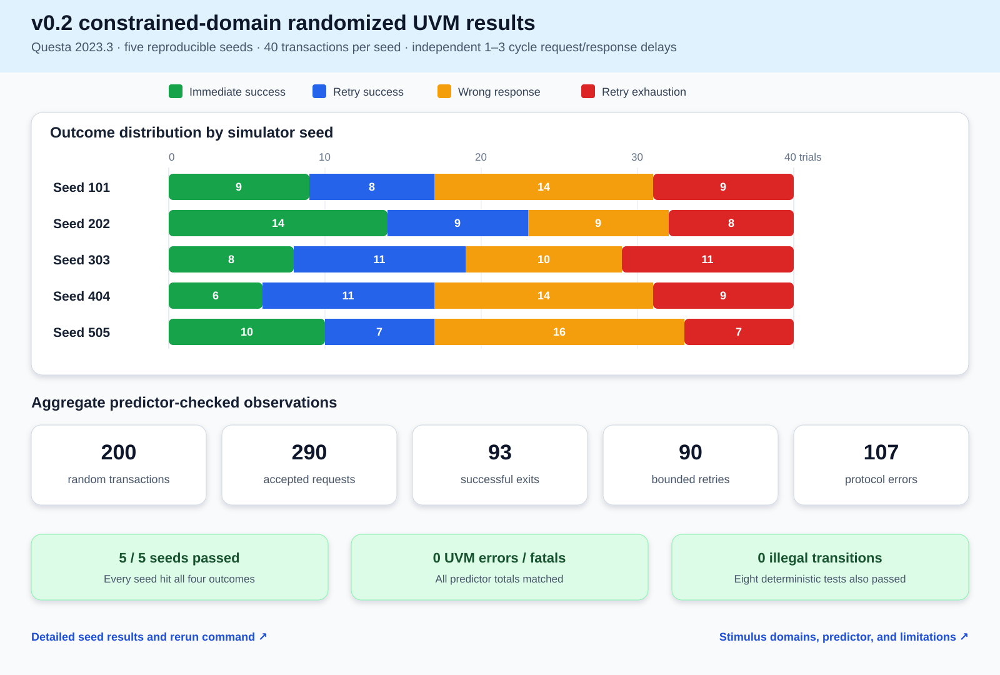

# v0.2 Randomized UVM Verification Update

## 1. Objective

Extend the released `v0.2-sideband` verification environment with repeatable randomized timing and outcome combinations while preserving the synthesizable RTL and implementation evidence unchanged.

## 2. Source identity

- Base release: `v0.2-sideband`
- Verification-only tag: `v0.2-random-uvm`
- DUT RTL delta: none
- Simulator: Questa Intel Starter FPGA Edition 2023.3 with bundled UVM 1.1d
- Run date: August 30, 2026

## 3. Random stimulus domain

Each seed runs 40 transactions. The DUT is reset between transactions. The first four transactions force one occurrence of every legal outcome; the remaining 36 select an outcome with the seeded simulator PRNG.

| Dimension | Explicit domain |
|---|---|
| Outcome | Immediate success, retry-success, wrong response, retry exhaustion |
| Transmit backpressure | 1-3 cycles |
| Response delay | 1-3 cycles, selected independently |
| Seeds | 101, 202, 303, 404, 505 |

Questa Starter does not license SystemVerilog class `randomize()` in this installation. The test therefore uses seeded `$urandom_range` calls with explicit legal domains. This is reproducible constrained-domain randomized testing, not class-constraint solving.

## 4. Verification connections



The UVM sequence predicts accepted requests, successful SBINIT exits, retries, and protocol errors. A passive monitor records the same four event classes. End-of-test checks require exact equality and at least one hit for every outcome.

## 5. Seed results

| Seed | Immediate success | Retry success | Wrong response | Retry exhaustion |
|---:|---:|---:|---:|---:|
| 101 | 9 | 8 | 14 | 9 |
| 202 | 14 | 9 | 9 | 8 |
| 303 | 8 | 11 | 10 | 11 |
| 404 | 6 | 11 | 14 | 9 |
| 505 | 10 | 7 | 16 | 7 |
| Total | 47 | 46 | 63 | 44 |



Aggregate observations across 200 transactions:

- 290 accepted sideband requests.
- 93 successful SBINIT exits.
- 90 bounded retries.
- 107 protocol errors.
- Zero UVM errors and zero UVM fatals.
- Zero illegal top-level transitions.
- Zero predictor-versus-monitor mismatches.
- Every outcome exercised by every seed.

## 6. Preserved regression gate

After the reset-aware driver and monitor timing were hardened, all earlier verification layers were rerun:

| Layer | Result |
|---|---|
| Seeded randomized UVM | 5/5 seeds pass; 200/200 transactions checked |
| Deterministic UVM | 8/8 tests pass |
| Legacy directed suite | Pass at 1276 ns |
| Sideband directed suite | Pass at 376 ns |
| Assertions | No failures |

Rerun commands:

```powershell
.\scripts\run_random_regression.ps1
.\scripts\run_uvm_regression.ps1
& 'C:\intelFPGA_lite\questa_fse\win64\vsim.exe' -c -do scripts/run_questa.do
& 'C:\intelFPGA_lite\questa_fse\win64\vsim.exe' -c -do scripts/run_sb_directed.do
```

## 7. Reused implementation evidence

No RTL, interface, state encoding, Quartus constraint, or generated netlist changed. The implementation evidence from [`v0.2-sideband`](v0.2_sideband.md) remains applicable:

- [Colorful sideband waveforms](../../assets/waveforms/v0.2-sideband/).
- [RTL connection diagram](../../assets/diagrams/v0.2-sideband/rtl-connections.svg).
- [Verification baseline diagram](../../assets/diagrams/v0.2-sideband/verification-connections.svg).
- [Quartus results](../06_results/quartus.md): 196 LEs, 66 registers, +1.617 ns setup slack, +0.455 ns hold slack, and 0.000 ns TNS at the checked 80 MHz constraint.
- [Functional Quartus netlist](../../synthesis/quartus/netlists/v0.2-sideband/ucie_ltsm.vo) and [verification-update identity manifest](../../synthesis/quartus/netlists/v0.2-random-uvm/README.md).

## 8. Evidence review

Both new SVG figures were checked structurally and rendered at full size, GitHub-reduced size, and enlarged detail crops. Text remains inside its intended box; connectors do not cross labels; there is no clipping or mixed content.

## 9. Limitations

- No class-constraint solving is available in the installed Questa Starter license.
- No UCDB or functional-covergroup percentage is published.
- The campaign covers one internal SBINIT-done transaction pair, not physical sideband framing, CRC, credits, repair, or the broader message set.
- Randomized bit corruption, full timeout-origin coverage, all retrain targets, L2 exit, mainband training engines, and UCIe compliance remain outside this update.
