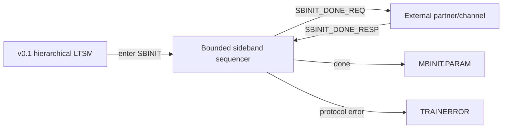
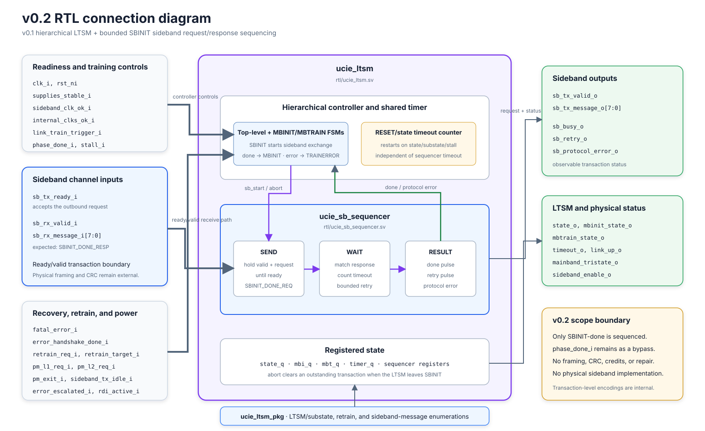

# Version 0.2 - Sideband Integration

> A later verification-only snapshot, [`v0.2-random-uvm`](v0.2_random_uvm.md), adds a five-seed constrained-domain campaign without changing this RTL or its implementation evidence.

## 1. Version objective

Extend the verified v0.1 hierarchical LTSM with one real, synthesizable transaction sequence: the request/response exchange that completes SBINIT.

## 2. Starting point

Version 0.2 is built directly on [v0.1 - Basic LTSM](v0.1_basic_ltssm.md). It preserves the nine top-level states, six MBINIT substates, thirteen MBTRAIN substates, shared state timer, retrain paths, power-management paths, recovery behavior, directed test, and four-test UVM baseline.

## 3. New concept

A sideband transaction lets the controller coordinate with a partner before mainband initialization begins. The sender presents a request and keeps it stable until the receiver accepts it. It then waits for the expected response. A missing response can be retried a bounded number of times; a wrong response or exhausted retry budget becomes a protocol error.

## 4. Why it is needed

In v0.1, `phase_done_i` could advance SBINIT without showing how two sides would exchange control information. Version 0.2 introduces an explicit ready/valid boundary, separates request acceptance from response arrival, and makes timeout/retry/error behavior observable and independently testable.

## 5. Architectural change





## 6. LTSM impact

No state or substate encoding changed.

| Area | v0.2 behavior |
|---|---|
| SBINIT entry | Starts the sideband sequencer when it is idle |
| SBINIT normal exit | `SBINIT_DONE_RESP` produces a completion pulse and advances to MBINIT |
| SBINIT compatibility exit | `phase_done_i` can still advance to MBINIT |
| Sideband error | Unexpected response or retry exhaustion asserts `sb_protocol_error_o` and selects TRAINERROR |
| Leaving SBINIT | Internal abort cancels an outstanding transaction |
| Other states | v0.1 behavior is preserved |

The added public interface is listed in the [signal guide](../02_ltssm/signals.md#waveform-signal-guide).

## 7. Algorithm changes

The sequencer has four encoded conditions: idle, send, wait, and error. On start, it latches the request and expected response. SEND holds `tx_valid` and the request value until `tx_ready`. WAIT accepts only the expected response, otherwise reports an error. A response timeout re-enters SEND while retries remain; after the configured budget is exhausted, the sequencer reports an error.

## 8. Pseudocode changes

```text
when LTSM enters SBINIT and the sequencer is idle:
    latch SBINIT_DONE_REQ and expected SBINIT_DONE_RESP
    hold transmit-valid until transmit-ready

after the request is accepted:
    if the expected response arrives:
        pulse done and allow SBINIT -> MBINIT
    else if a different response arrives:
        pulse protocol_error and select TRAINERROR
    else if response timeout expires:
        if retry budget remains:
            pulse retry and send the request again
        else:
            pulse protocol_error and select TRAINERROR

if the LTSM leaves SBINIT for any reason:
    abort and clear the outstanding transaction
```

## 9. RTL changes

Added:

- [`rtl/ucie_sb_sequencer.sv`](../../rtl/ucie_sb_sequencer.sv)
- `sb_msg_e` and three message labels in [`rtl/ucie_ltsm_pkg.sv`](../../rtl/ucie_ltsm_pkg.sv)

Modified:

- [`rtl/ucie_ltsm.sv`](../../rtl/ucie_ltsm.sv) integrates the sequencer and exposes the ready/valid and status ports.
- Questa and Quartus source lists compile the new module.

Parameters `SB_RESPONSE_TIMEOUT_CYCLES` and `SB_MAX_RETRIES` control response waiting and retry count. Their defaults are 256 cycles and one retry.

## 10. Directed verification

[`verification/tb_ucie_sb_sequencer.sv`](../../verification/tb_ucie_sb_sequencer.sv) isolates the sequencer and checks:

- request/message stability during transmit backpressure;
- expected-response completion;
- timeout followed by one retry and success;
- retry-budget exhaustion;
- rejection of an unexpected response; and
- clean abort of an outstanding request.

Observed result: `PASS: sideband backpressure, success, retry, exhaustion, mismatch, and abort` at 376 ns, with no assertion failure.

## 11. UVM verification

The four v0.1 tests remain in the regression. Four new tests exercise the integrated LTSM and sequencer:

| Test | Verified result |
|---|---|
| `sb_success_test` | One accepted request and SBINIT-to-MBINIT completion |
| `sb_retry_test` | Two accepted requests, one retry, then completion |
| `sb_error_test` | Wrong response, protocol error, and TRAINERROR |
| `sb_exhaust_test` | One retry, retry exhaustion, protocol error, and TRAINERROR |

All eight tests pass with zero UVM errors, zero UVM fatals, and zero illegal top-level transitions.


## 12. Results

- Legacy directed test: pass at 1276 ns.
- Sideband directed test: pass at 376 ns.
- UVM regression: all eight tests pass.
- Quartus full compile: successful for Cyclone 10 LP `10CL025YU256C8G`.
- Resources: 196 logic elements and 66 registers.
- Slow 1200 mV, 85 C setup slack: +1.617 ns at the checked 80 MHz constraint.
- Slow 1200 mV, 85 C hold slack: +0.455 ns.
- Design-wide TNS: 0.000 ns.

### Release evidence package

| Evidence | Artifact |
|---|---|
| Success/backpressure/retry | [SVG waveform](../../assets/waveforms/v0.2-sideband/success-bounded-retry.svg) |
| Exhaustion/mismatch/abort | [SVG waveform](../../assets/waveforms/v0.2-sideband/exhaustion-mismatch-abort.svg) |
| RTL integration | [SVG diagram](../../assets/diagrams/v0.2-sideband/rtl-connections.svg) |
| Verification integration | [SVG diagram](../../assets/diagrams/v0.2-sideband/verification-connections.svg) |
| Quartus functional netlist | [Generated Verilog](../../synthesis/quartus/netlists/v0.2-sideband/ucie_ltsm.vo) |


## 13. What changed from the previous version?

| Area | v0.1 | v0.2 |
|---|---|---|
| SBINIT completion | Abstract `phase_done_i` | Explicit ready/valid request and matched response; bypass retained |
| Sideband RTL | None | Bounded request/response sequencer |
| Error evidence | LTSM error paths | Adds malformed response and retry-exhaustion paths |
| UVM suite | Four tests | Eight tests |
| Quartus resources | 152 LEs / 48 registers | 196 LEs / 66 registers |

## 14. Preserved functionality

- All v0.1 state and substate encodings and ordered progressions.
- RESET residence and eligible-state timeout behavior.
- ACTIVE retraining, fatal-error recovery, and L1 exit behavior.
- The existing directed test, SVA, UVM scoreboard, and four original UVM tests.
- The v0.1 tag, source snapshot, diagrams, waveforms, and netlist.

## 15. Current limitations

- Only the SBINIT-done message pair is implemented.
- Message values are internal transaction-level encodings, not a complete UCIe physical sideband packet format.
- No physical detection, repair, framing, CRC, credits, or automatic remote-request responder exists.
- `phase_done_i` remains a bypass and still abstracts MBINIT, MBTRAIN, and PHYRETRAIN operations.
- There is no merged UCDB code/assertion/functional coverage closure report or randomized corruption campaign.
- FPGA I/O timing and pins are incomplete; no Cadence ASIC evidence is present.

## 16. Next planned stage

Version 0.3 is planned to add a concrete training-operation engine while preserving the v0.2 sideband layer. Its exact scope must be selected and implemented before documentation can claim it exists.
