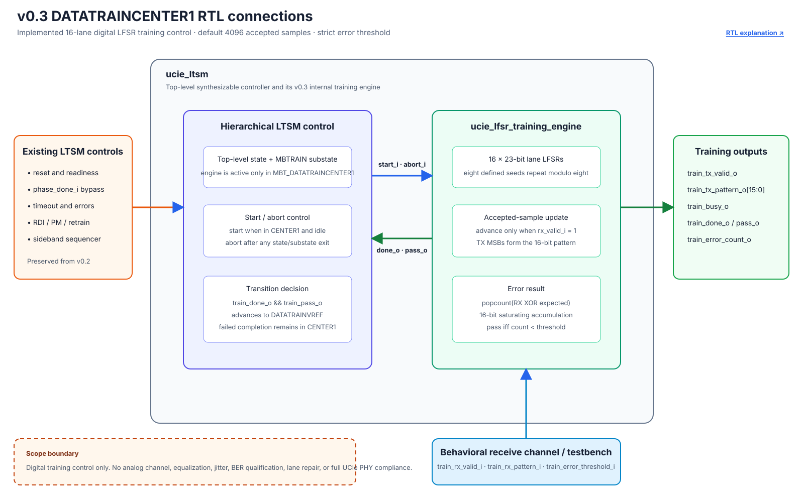

# v0.3 DATATRAINCENTER1 Advanced Training

## 1. Objective

Replace one abstract MBTRAIN operation with a synthesizable digital training engine: sixteen deterministic lane patterns, accepted-sample checking, saturating error accumulation, a strict configurable pass threshold, and automatic successful advance from `DATATRAINCENTER1` to `DATATRAINVREF`.

This is a digital training-control milestone, not a complete UCIe PHY or compliance claim.

## 2. Source identity

- Base release: `v0.2-random-uvm` / `61f0d23d01568e5c9c9dd1b83d1e40cea1db729a`
- Design checkpoint: `c052615dab54d0b4ab4ea19df78e0454ddbd36b6`
- Verification checkpoint: `f4622ad463a0e3e84db1551a2a8bb4d334c0e443`
- Release tag: `v0.3-advanced-training`
- Simulator: Questa Intel Starter FPGA Edition 2023.3 with bundled UVM 1.1d
- Implementation tool: Quartus Prime Lite 23.1std.1

## 3. Implemented RTL

[`ucie_lfsr_training_engine.sv`](../../rtl/ucie_lfsr_training_engine.sv) adds:

- sixteen 23-bit Fibonacci LFSRs;
- eight lane seeds repeated modulo eight;
- polynomial `X^23 + X^21 + X^16 + X^8 + X^5 + X^2 + 1`;
- a 16-bit generated training pattern;
- progression only on accepted receive samples;
- mismatch popcount and a 16-bit saturating error count;
- a configurable sample count, defaulting to 4096; and
- strict pass behavior: `error_count < error_threshold`.

[`ucie_ltsm.sv`](../../rtl/ucie_ltsm.sv) starts the engine only in `MBT_DATATRAINCENTER1`. `done && pass` advances to `MBT_DATATRAINVREF`; a failed attempt remains in place and repeats. Reset or leaving the substate aborts and clears the engine. The existing `phase_done_i` compatibility bypass remains.



## 4. Verification architecture

The verification checkpoint adds a focused directed boundary test, training-specific SVA, and a five-seed UVM campaign with an independent lane/polynomial/error reference model.


Questa Starter cannot license class `randomize()` or native covergroups. The test therefore uses seeded `$urandom_range` over explicit legal domains and reports explicit sampled bins/crosses. No native UCDB percentage is claimed.

## 5. Randomized results

Seeds `701`, `802`, `903`, `1004`, and `1105` each ran 32 reset-isolated trials.

| Outcome | Aggregate count |
|---|---:|
| Direct pass | 47 |
| Fail followed by retry | 32 |
| Abort | 44 |
| LTSM timeout | 37 |
| Successful completed attempts | 79 |
| Failed completed attempts | 32 |

Across 160 trials, the independent model checked 368 clean and 654 corrupted accepted samples plus 1,768 receive-gap cycles. All outcome, error-range, gap-range, threshold, and twelve scenario-by-gap cross bins were hit. Every seed ended with zero UVM errors/fatals, zero illegal LTSM transitions, zero assertion failures, and exact DUT/reference matches.

## 6. Directed and preserved regression

The focused directed test proves lane initialization, every polynomial step, valid gaps, strict equality failure, threshold-above-count pass, abort clearing, default 4096-sample completion, and `16'hffff` saturation after 65,536 injected bit errors.

The complete gate passed independently:

| Layer | Result |
|---|---|
| DATATRAINCENTER1 randomized UVM | 5/5 seeds; 160/160 trials |
| Deterministic UVM | 8/8 tests |
| Preserved v0.2 randomized UVM | 5/5 seeds; 200/200 transactions |
| Base directed suite | Pass at 1276 ns |
| Sideband directed suite | Pass at 376 ns |
| LFSR directed suite | Pass at 41576 ns |
| Assertions | Zero failures |

See the [detailed results](../06_results/datatrain_lfsr.md) and [test plan](../05_verification/testplan.md).

## 7. Colorful waveform evidence


This figure shows the clean eight-sample attempt, generated/received pattern values, two-cycle receive gaps, zero errors, and final done/pass result.


This figure separates clean pass, equality failure, threshold-above-count pass, and abort clearing. Each colored signal label links to its [definition and functionality](../02_ltssm/signals.md#v03-training-signal-guide).

## 8. Quartus and netlist evidence

Quartus full compilation passed for Cyclone 10 LP `10CL025YU256C8G`:

- 698 logic elements;
- 465 registers;
- 126 pins;
- +0.744 ns worst setup slack at the checked 80 MHz internal clock constraint;
- +0.178 ns worst hold slack across reported corners;
- zero setup/hold TNS;
- zero errors and 15 warnings.

The design is not fully constrained because external I/O delays and exact pin locations are absent. These are FPGA implementation results, not ASIC timing or PHY link-rate evidence.

The reviewed [functional netlist](../../synthesis/quartus/netlists/v0.3-advanced-training/ucie_ltsm.vo) has SHA-256 `09D414CA3B4CF192F8D83119F18AC6994FB0C4A6F707C0021E405D1B7AFEC04C`; see its [manifest](../../synthesis/quartus/netlists/v0.3-advanced-training/README.md).

## 9. Reproduce

```powershell
& 'C:\intelFPGA_lite\questa_fse\win64\vsim.exe' -c -do scripts/run_lfsr_directed.do
.\scripts\run_datatrain_random_regression.ps1
.\scripts\run_uvm_regression.ps1
.\scripts\run_random_regression.ps1
& 'C:\intelFPGA_lite\questa_fse\win64\vsim.exe' -c -do scripts/run_questa.do
& 'C:\intelFPGA_lite\questa_fse\win64\vsim.exe' -c -do scripts/run_sb_directed.do
& 'C:\intelFPGA_lite\questa_fse\win64\vsim.exe' -c -do scripts/capture_datatrain_waveform.do
python scripts/render_datatrain_waveforms.py
.\scripts\export_quartus_netlist.ps1 -Version v0.3-advanced-training
```

## 10. Limitations

- The UVM campaign uses eight samples per attempt for throughput; the default 4096 count is proven in the focused directed test.
- No native covergroup/UCDB percentage is available under the installed Starter license.
- `phase_done_i` remains a compatibility bypass and can force an externally controlled exit.
- The receive path is a behavioral digital channel, not physical UCIe signaling.
- Analog calibration, jitter, equalization, eye/BER measurement, lane repair, package effects, RDI, CSR/DVSEC, ASIC PPA, and compliance testing remain outside this release.

Terminology and abbreviation long forms are collected in the [project glossary](../glossary.md).
