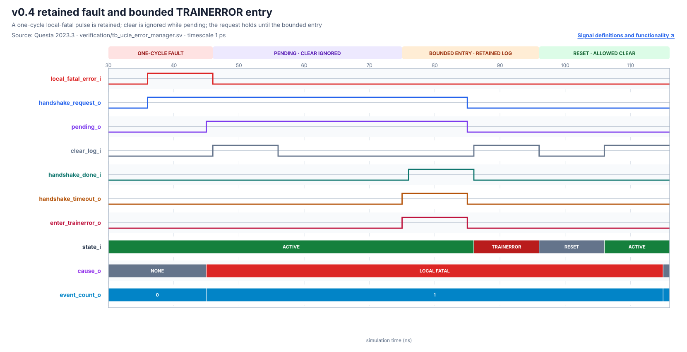
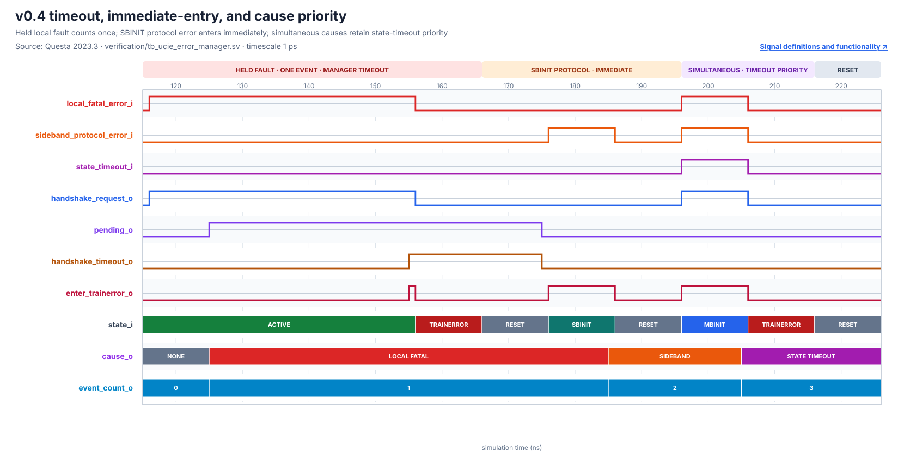
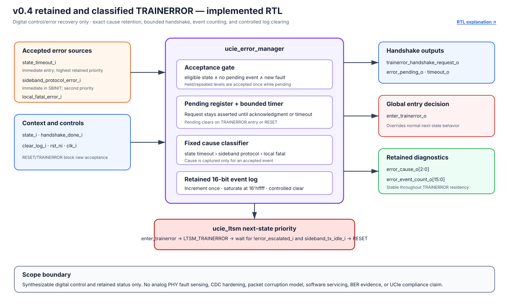

# v0.4 Retained TRAINERROR and FPGA CSR Wrapper

## 1. Release identity

- Release tag: `v0.4-error-recovery`
- Stable baseline: `v0.3-advanced-training`, commit `62a6cdd45eb95a6ef36a67f07aa4b120b862133b`
- Recovery design: `1637c42ab327c14613726907a2ca45aa77b8fc4b`
- Recovery verification: `d13ba02fdfcdae2c1bfb388acaeb323108003d2d`
- FPGA wrapper design: `8e5daa9c8fa6133414d36f3e2a687d94ee6fadd9`
- Wrapper verification: `23205f08f16230bdc4925b38cbf2eb9535afc69f`
- Simulation: Questa Intel FPGA Starter 2023.3
- Implementation: Quartus Prime Lite 23.1std.1, Cyclone 10 LP `10CL025YU256C8G`

This is a digital training-control and error-recovery milestone. It is not a complete UCIe PHY, a board-timing signoff, or a UCIe compliance claim.

## 2. What changed

The reusable `ucie_ltsm` now integrates `ucie_error_manager`, which:

- accepts eligible state-timeout, SBINIT protocol, or local-fatal events;
- captures simultaneous causes with fixed priority: state timeout, sideband protocol, local fatal;
- retains a one-cycle fault through a persistent request;
- enters TRAINERROR immediately for state timeout and SBINIT protocol error, or after acknowledgment/bounded wait for other faults;
- counts each accepted event once in a saturating 16-bit counter;
- retains cause/count across normal TRAINERROR-to-RESET recovery; and
- ignores clear while an event is pending or while the controller is in TRAINERROR.

The separate `ucie_ltsm_fpga_wrapper` leaves that core unchanged, internalizes wide state/error/training diagnostics, and exposes them through a byte-wide CSR interface. This replaces an unfittable 149-pin core top with a fitted 119-pin wrapper without virtual pins. The exact [CSR map and status-bit layout](../06_results/fpga_csr_wrapper.md#csr-map) are documented as part of the release interface.


## 3. Verification gate

All required checks passed in fresh invocations:

| Gate | Result |
|---|---|
| FPGA CSR directed test | PASS: version/state/status reads, retained fatal cause/count, protected/allowed clear, invalid read |
| Error-manager directed suite | PASS: retention, priority, exact handshake bound, clear rules, saturation |
| Controller, sideband, LFSR directed suites | PASS |
| Deterministic UVM | 9 tests PASS |
| Sideband constrained-random | seeds 101/202/303/404/505; 200 transactions PASS |
| DATATRAINCENTER1 constrained-random | seeds 701/802/903/1004/1105; 160 trials PASS |
| Recovery constrained-random | seeds 1201/1302/1403/1504/1605; 180 trials PASS |
| Assertions and scoreboards | zero assertion failures, illegal transitions, UVM errors/fatals, or predictor mismatches |

Recovery coverage spans all seven implemented originating states and six recovery scenarios. Aggregate scenario totals were 36 delayed acknowledgments, 30 missing acknowledgments, 32 state timeouts, 32 SBINIT protocol errors, 25 TRAINERROR-residency checks, and 25 simultaneous-cause checks. See the [measured recovery result](../06_results/error_recovery.md) and [test plan](../05_verification/testplan.md).

## 4. Waveform evidence

The colorful SVGs are rendered from self-checking Questa VCDs. Every signal label hyperlinks to its definition and functional interpretation.






## 5. Connection evidence




The diagrams distinguish implemented RTL, independent prediction/SVA/coverage, wrapper visibility, and the excluded analog/board/compliance scope. All six v0.4 SVGs were reviewed repeatedly at full resolution, reduced width, and enlarged detail; labels, arrows, and boxes remain separated and unclipped.

## 6. Quartus and netlists

The compact wrapper completed full Quartus compilation with zero errors:

| Measure | Result |
|---|---:|
| Logic elements | 804 / 24,624 (3%) |
| Registers | 499 |
| Physical pins | 119 / 151 (79%) |
| Virtual pins | 0 |
| 80 MHz worst setup slack | `+0.624 ns` |
| Worst hold slack across analyzed corners | `+0.178 ns` |
| Setup/hold TNS | `0.000 ns` |

The result qualifies analyzed internal-clock paths only. Exact board pin assignments and external I/O delays are not defined. The [wrapper result page](../06_results/fpga_csr_wrapper.md) records warnings and commands.

The release retains two reviewed functional netlists:

- [`ucie_ltsm_fpga_wrapper.vo`](../../synthesis/quartus/netlists/v0.4-error-recovery/ucie_ltsm_fpga_wrapper.vo), SHA-256 `102231FB12CEA16D83070312EFF10FC04A95E0C85D297AE48ABB5D1515D13B52`, is the fitted release boundary.
- [`ucie_ltsm.vo`](../../synthesis/quartus/netlists/v0.4-error-recovery/ucie_ltsm.vo), SHA-256 `34756D33181875CB10D05FEBB60E079814EEB98301CB9FA01BE0F5F08BDEF969`, is a core-only synthesis/functional-simulation view with no fitter claim.

See the [netlist provenance manifest](../../synthesis/quartus/netlists/v0.4-error-recovery/README.md).

## 7. Reproduction

```powershell
vsim -c -do scripts/run_fpga_wrapper_directed.do
vsim -c -do scripts/run_error_directed.do
.\scripts\run_uvm_regression.ps1
.\scripts\run_random_regression.ps1
.\scripts\run_datatrain_random_regression.ps1
.\scripts\run_recovery_random_regression.ps1
vsim -c -do scripts/capture_error_waveform.do
vsim -c -do scripts/capture_fpga_wrapper_waveform.do
python scripts/render_error_waveforms.py
.\scripts\export_quartus_netlist.ps1 -Version v0.4-error-recovery -Project ucie_ltsm_fpga -OutputName ucie_ltsm_fpga_wrapper.vo
```

## 8. Remaining limitations

- Analog PHY behavior, channel loss/noise, jitter, eye/BER measurement, lane repair, interoperability, and compliance testing are outside scope.
- The CSR is a compact FPGA debug/management boundary, not a complete DVSEC, RDI management transport, firmware stack, or software interrupt model.
- External asynchronous controls do not yet have production CDC hardening or metastability fault injection.
- Native UVM covergroup/UCDB percentages are unavailable under the Starter license; the release uses explicit sampled bins/crosses.
- Board pin locations and external input/output delays are absent; only internal 80 MHz clock timing is qualified.
- Existing warnings for constant sideband bits, unused CSR write bits, incomplete I/O constraints, Lite LogicLock support, and one parameter-width truncation remain documented.

Definitions and abbreviation long forms are centralized in the [project glossary](../glossary.md#v04-error-recovery-and-fpga-wrapper-terms).
